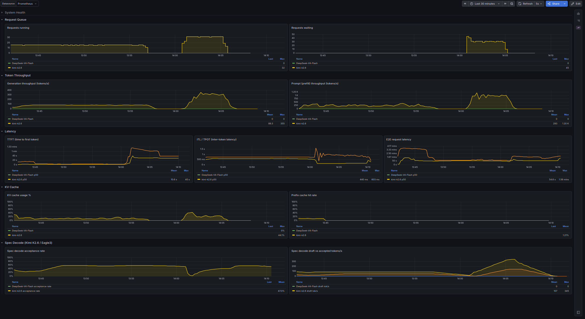

# nanoserve-mini

12-week LLM inference performance lab. vLLM serving baseline,
observability, benchmark harness, workload + KV/prefix cache analysis,
one Triton kernel, technical write-ups, final decision document.

Standalone portfolio artifact that also acts as a decision gate for a
possible full `nanoserve` follow-up.

> **[→ Interactive architecture diagram](https://czyszka.github.io/nanoserve-mini/architecture.html)** — full visual map of services, scripts, modules, and data flows.

## Phase 1 results

Live Grafana dashboard during a load test of **Kimi-K2.6** (vLLM, TP=8, Eagle3
speculative decoding, batched `--max-num-seqs 32`) driven by a SWE-bench Lite
workload through `vllm bench serve` — request queue, token throughput,
TTFT / ITL / E2E latency, KV-cache usage and spec-decode acceptance, all scraped
into Prometheus and rendered from the provisioned Phase 1 dashboard.

<a href="results/runs/2026-06-05_w1_evidence/2026-06-05_grafana_dashboard-max_num_seqs_32.png">
  
</a>

<sub><i>Click the image to view it full size.</i></sub>

## Current work

Source of truth for human work: this README.

Current phase: **Phase 1** - vLLM serving baseline + LiteLLM Proxy +
observability.

What works:

- Kimi-K2.6 runs through vLLM on the 8xH200 server.
- DeepSeek-V4-Flash runs alongside Kimi as a smaller vLLM service.
- OpenWebUI is connected.
- LiteLLM Proxy routes by `model` to Kimi and DeepSeek.
- Benchmark scripts exist under `benchmarks/scripts/`.
- `benchmarks/scripts/run_bench_suite.py` has completed proxy benchmark
  runs for both models.
- Prometheus + Grafana compose with a provisioned Phase 1 dashboard,
  validated under live `vllm bench serve` load (see *Phase 1 results* above).

Next 3 actions:

1. Add/validate DCGM Exporter GPU hardware metrics (power, SM/Tensor/DRAM
   activity, VRAM) — the load test showed 100% GPU-util at ~180 W, a
   memory-bound signal invisible without DCGM.
2. Prepare the W1 write-up now that observability is coherent.
3. Capture bench numbers from Prometheus into the W1 evidence summary.

Do not use `docs/operations/agent-state.md` as the human project dashboard. It
is an AI-agent handoff file.

Laptop is for code, docs, analysis, benchmark preparation. The 8xH200
server is the primary GPU runtime.

## Repository layout

```text
benchmarks/
  scripts/          Benchmark + metrics producers (CLI):
                      request_once, measure_ttft_once,
                      run_sequential_benchmark,
                      collect_metrics_snapshot, sample_gpu_metrics,
                      run_bench_suite, check_server_env
                    plus shared library:
                      _client, _metrics, _schemas, _server_metrics
  scripts_tests/    Pytest suite (mocked httpx / subprocess; no GPU needed).

serving/
  compose/          Docker Compose for vLLM + OpenWebUI on the server.
  runbooks/         Operational instructions (env bootstrap, vLLM launch).

results/
  raw/              Raw artifacts kept in Git (env snapshots, small inputs).
  runs/             Per-run benchmark/metrics output under <run_id>/<mode>/.
  summaries/        Aggregated text/CSV/Markdown summaries.

docs/
  project/          Roadmap and long-term scope.
  operations/       agent-state, benchmark methodology, infrastructure.
  learning/         Reading list, NVIDIA courses, paper notes.
  plans/            Time-bound session plans.
  templates/        Markdown + agent-routine templates.
  weekly/           Weekly progress notes.
```

Quick map: code lives in `benchmarks/`, operations in `serving/`, outputs
in `results/`, everything else in `docs/`.

## Scope

See [`docs/project/roadmap.md`](docs/project/roadmap.md) for the full
definition of done, phase plan, decision points, and the section on
material brought into scope via the parallel company H200 project
(TP scaling, MoE serving, FP8, multi-tenant - measured at work, written
up here).

Phase 1 deliverables still owed: live validation of the Prometheus + Grafana
dashboard, GPU hardware metrics, and write-up W1.

## Local development

Requirements: Windows 11 or Linux, Python 3.12, `uv`, Git.

```bash
uv sync --extra dev
uv run ruff check .
uv run pytest
```

Local validation helper (Windows):

```powershell
.\benchmarks\scripts\check_local.ps1
```

## GPU server

Record an environment snapshot to `results/raw/server_env_snapshot.json`:

```bash
uv run python -m benchmarks.scripts.check_server_env
```

Compose stack and runbooks: [`serving/compose/`](serving/compose/),
[`serving/runbooks/`](serving/runbooks/).

Results / secrets policy: never commit `.env`, API keys, HF / W&B / cloud
tokens, model weights, HF cache, large logs, full Nsight traces
(`*.ncu-rep`, `*.nsys-rep`), or large benchmark artifacts. See
[`docs/operations/infrastructure.md`](docs/operations/infrastructure.md)
for the full list and rotation procedure if a secret leaks.

## Key docs

- [Roadmap](docs/project/roadmap.md) - scope, phases, definition of done.
- [Benchmark methodology](docs/operations/benchmark-methodology.md) - measurement contract.
- [2026-05-19 server session summary](docs/plans/2026-05-19-server-session-summary.md) - Phase 1 server close-out summary.
- [Serving compose](serving/compose/) - server stack.
- [Architecture diagram](https://czyszka.github.io/nanoserve-mini/architecture.html) - visual map of all services, scripts, and data flows.
