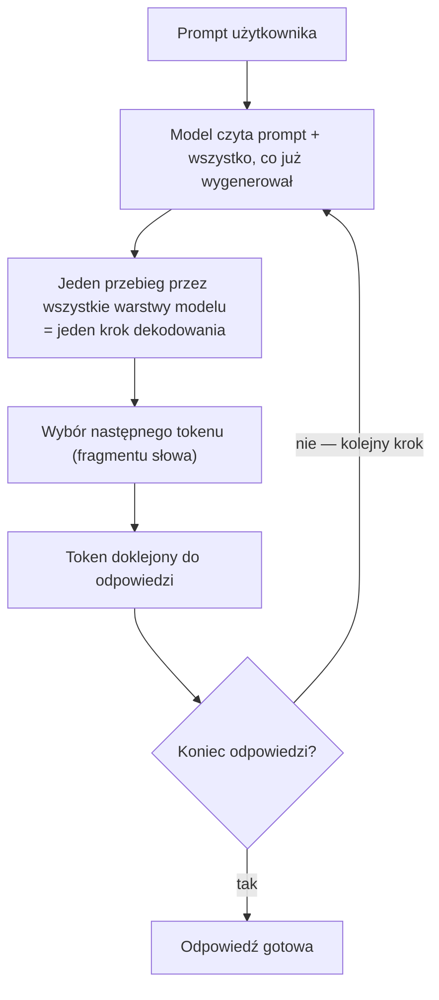
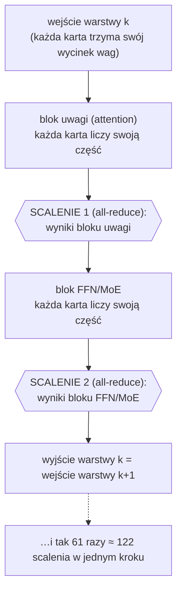
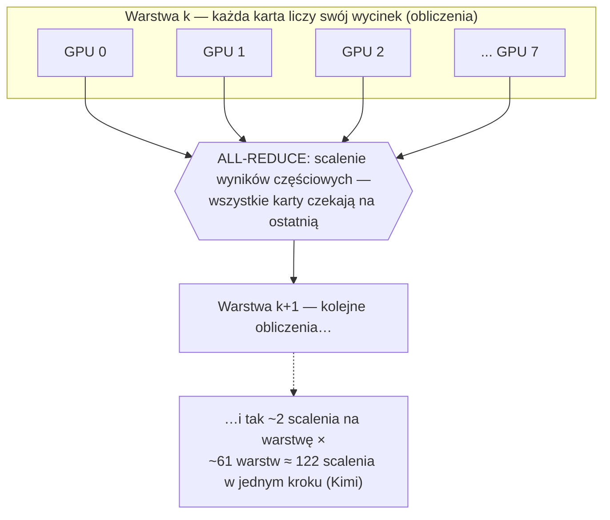
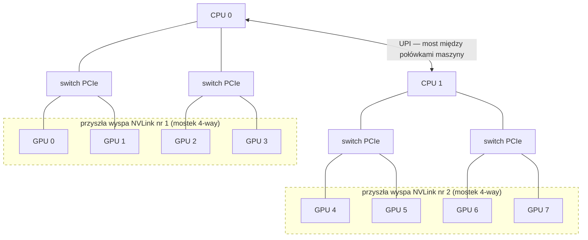

# Ocena zasadności zakupu mostków NVLink 4-way dla węzła 8×H200

## 1. Rekomendacja

Z przeprowadzonych pomiarów i obliczeń wynika, że zakup mostków NVLink 4-way jest uzasadniony tylko wtedy, gdy serwer przeznaczony jest do obsługi wielu zapytań równolegle, a rozmiar modelu sieci neuronowej wymaga rozłożenia wag na co najmniej 4 karty GPU. W tym trybie pracy zmierzony oczekiwany zysk wynosi 2–3x przepustowości generowania (liczba tokenów produkowanych na sekundę dla wszystkich klientów). Teoretyczne maksimum to zysk około 6-krotny. Przy obsłudze pojedynczych zapytań (np. jeden czat „na żywo"), nawet dla modelu zajmującego 4–8 kart, zysk jest niewielki (poniżej 1,3×), a dla modeli mieszczących się na 1 lub 2-óch kartach GPU zysku nie ma wcale (około 0x).

Jako kryterium decyzji przyjęto prawo Amdahla, stosowane w obliczeniach równoległych do wyznaczania teoretycznej górnej granicy przyspieszenia. Mówi ono, że inwestycja przyspiesza tylko tę część pracy, której fizycznie dotyczy. NVLink jest szybszym od PCIe łączem między kartami GPU, skraca więc wyłącznie czas komunikacji między nimi. Jeżeli komunikacja zajmuje ułamek s czasu pojedynczego kroku generowania, to nawet nieskończenie szybkie łącze przyspieszy cały mechanizm najwyżej 1/(1−s) razy (obliczenia: sekcja 7). Decyzja o zakupie sprowadza się zatem do pomiaru, jaką część czasu kroku generowania serwer spędza na komunikacji. Pomiar tej wielkości jest przedmiotem niniejszej notatki, a odpowiedź zależy od trybu pracy serwera:

- równoległa obsługa wielu zapytań przez model zajmujący 8 kart:
  komunikacja zajmuje 84% czasu kroku (sekcja 6d);
- równoległa obsługa wielu zapytań przez model zajmujący 4 karty: 53%
  (sekcja 6d);
- obsługa jednego zapytania na raz przez model zajmujący 8 kart: 22%
  (sekcja 6d);
- obsługa jednego zapytania na raz przez model zajmujący 4 karty: 15% (sekcja 6b);
- model zajmujący 1–2 karty, niezależnie od liczby równoległych zapytań:
  komunikacja kosztuje ≤1 ms na kroku ~10 ms (sekcja 6b), a nawet jej
  celowe pogorszenie (wymuszenie ruchu między kartami przez
  pamięć procesora; sekcja 6c) zmienia przepustowość o mniej niż 1%.


## 2. Zakres badania i warunki testowe

Przedmiotem badania jest serwer Supermicro SYS-521GE-TNRT wyposażony w dwa procesory Intel Xeon Gold 6530 oraz osiem kart NVIDIA H200 NVL (143 GB pamięci HBM3e na kartę). Karty komunikują się wyłącznie przez magistralę PCIe Gen5 — w topologii czterech przełączników po dwie karty, bez NVLink i bez NVSwitch (pełny schemat: Załącznik B). Modele językowe serwuje na nim silnik vLLM v0.20 uruchomiony w kontenerach Docker i udostępnia je użytkownikom przez API.

Badaniu podlegają trzy składniki procesu generowania odpowiedzi na tym serwerze: czas pojedynczego kroku generowania (to on decyduje o szybkości odpowiedzi), komunikacja między kartami po PCIe (jedyne, co zmieniłby zakup NVLink) oraz stały narzut silnika serwującego (czas, który silnik zużywa przy każdym kroku na czynności organizacyjne m.in. ustalenie, które zapytania wejdą do bieżącego kroku, wybór kolejnego fragmentu tekstu, wymiana poleceń między procesorem a kartami). Narzut silnika to druga możliwa przyczyna spowolnień: jeśli to ona dominuje, dodanie szybszego łącza nie przyspieszy serwera.

Głównym serwowanym modelem jest Kimi-K2.6 — model otwarty (open-weight) o około bilionie parametrów (1T), który w publicznym benchmarku zadań programistycznych SWE-bench Verified osiąga wyniki porównywalne z czołowymi modelami komercyjnymi. Rozmiar modelu, około 554 GB samych wag, wymusza pracę na wszystkich ośmiu kartach GPU jednocześnie (obliczenia: sekcja 4).

Pozycję modelu w stawce ilustruje poniższe zestawienie:

| Model | SWE-bench Verified | Źródło |
|---|---:|---|
| Claude Opus 4.8 | 88,6% | [benchlm.ai](https://benchlm.ai/benchmarks/sweVerified) |
| GPT-5.3-Codex | 85,0% | [tokenmix.ai](https://tokenmix.ai/blog/swe-bench-2026-claude-opus-4-7-wins) |
| Gemini 3.1 Pro | 80,6% | [tokenmix.ai](https://tokenmix.ai/blog/swe-bench-2026-claude-opus-4-7-wins) |
| **Kimi-K2.6** | **80,2%** | [tokenmix.ai](https://tokenmix.ai/blog/kimi-k2-6-code-preview-review-2026) |

*(Wyniki z publicznych zestawień, stan: czerwiec 2026; służą wyłącznie
umiejscowieniu modelu w stawce — nie były mierzone w tym projekcie.)*

Punktem wyjścia badania była obserwacja, że pod pełnym obciążeniem, gdy licznik GPU-Util z popularnego narzędzia nvidia-smi wskazuje 100%, żaden zasób serwera nie zbliża się do nasycenia: pamięć HBM jest aktywna przez 7–9% czasu, jednostki obliczeniowe przez około 20%, łącze PCIe używa około 10% swojej przepustowości, a pobór mocy sięga około 30% limitu (pomiary: sekcja 6a). Mimo to opóźnienie między generowanymi tokenami rośnie wraz z liczbą równolegle obsługiwanych zapytań, a dołożenie kolejnych kart dodatkowo je pogarsza. Standardowa diagnostyka, polegająca na poszukiwaniu nasyconego zasobu, nie wskazuje tu więc żadnej przyczyny.

Pozorna sprzeczność między wskazaniem „100% zajętości" a niskim wykorzystaniem zasobów wynika ze sposobu pomiaru. Licznik GPU-Util informuje jedynie, że karta ma w danej chwili przydzielone zadanie, ale nie mówi nic o tym, czy zadanie to wykonuje obliczenia, czy czeka na dane. Stan faktyczny pokazuje dopiero telemetria sprzętowa DCGM (sekcja 3), z której pochodzą przytoczone wyżej odczyty: karty przez większość czasu nie wykonują obliczeń, lecz na coś czekają. Ustaleniu, na co czekają, poświęcona jest dalsza część notatki.

Zgodnie z kartą katalogową, producent serwera przewiduje dla tej maszyny opcjonalne rozszerzenie:
mostki NVLink (w karcie katalogowej: „GPU-GPU interconnect: NVIDIA NVLink
Bridge, optional"). Mostek NVLink 4-way łączy cztery sąsiednie karty w „wyspę"
z bezpośrednim łączem GPU-GPU.

| parametr | PCIe Gen5 x16 (H200 NVL) | NVLink Bridge (H200 NVL) |
|---|---|---|
| nominalna przepustowość dwukierunkowa GPU-GPU | 128 GB/s | 900 GB/s |
| opóźnienie pojedynczej wymiany P2P (GPU-GPU) | 20 µs | 2-9 µs |
| droga sygnału | GPU → switch PCIe (czasem → CPU → UPI) → GPU | bezpośrednio GPU↔GPU wewnątrz wyspy; między wyspami nadal PCIe/UPI |

Nominalną przepustowość podano w [karcie katalogowej NVIDIA H200 NVL](https://www.pny.com/file%20library/company/support/linecards/data-center-gpus/h200-nvl-datasheet.pdf). Opóźnienia dla kart GPU H200 NVL nie są publikowane oficjalnie, wartości oszacowano na podstawie [pomiarów dostęnych publicznie](https://intuitionlabs.ai/articles/nvidia-nvlink-gpu-interconnect)
(transfery P2P na kartach A100: 2 µs przez NVLink wobec 20 µs przez
PCIe 4.0) oraz artykułu naukowego [Evaluating Modern GPU Interconnect: PCIe, NVLink, NV-SLI, NVSwitch and GPUDirect](https://arxiv.org/abs/1903.04611) (transfery P2P na kartach P100/V100: 9 µs przez NVLink wobec 20 µs przez PCIe 4.0)

Na podstawie powyższego porównania, nasuwa się przypuszczenie, że większa przepustowość oraz niższe opóźnienia na szynie komunikacyjnej pomiędzy kartami przyspieszą pracę serwera.

## 3. Wnioski dla scenariuszy użycia

### 3.1. Tabela decyzji

Poniżej zestawiono zbadane scenariusze obciążenia maszyny. Kolumna TP podaje, na ile kart
podzielony jest model (wyjaśnienie w sekcjach 3–4), a c (współbieżność) ilu klientów serwer obsługuje jednocześnie: c=1 to jedna rozmowa na
żywo, c=64 — dziesiątki równoległych zapytań (np. kilka czatów na żywo
plus agenci programistyczni utrzymujący po kilka zapytań naraz). 
Zyski, zgodnie z prawem Amdahla, wynika z udziału komunikacji w całkowitym czasie kroku generowania (sekcja 6d).

| Scenariusz | TP | Ruch | Decyzja | Zysk | Podstawa pomiarowa |
|---|---|---|---|---|---|
| ≤ ~200 mld par. (FP8) — mieści się na 1–2 kartach | 1–2 | dowolny | nie kupuj | ≈ 0 | ≈ 0% kroku (szum) |
| ≤ ~200 mld par. (FP8) podzielone na ≥4 karty, choć mieści się na mniej | 4–8 | dowolny | nie kupuj — popraw konfigurację | — | 31% przepust. TP2 |
| ~200–500 mld par. (FP8) — wymaga 4 kart | 4 | pojedynczy (c=1) | nie kupuj | znikomy | 14,8% kroku |
| ~200–500 mld par. (FP8) — wymaga 4 kart | 4 | masowy (c=64) | kupuj | ~2,1× | 53,3% kroku |
| ~0,5–1 bln par. (FP8) — wymaga 8 kart | 8 | pojedynczy (c=1) | nie kupuj | ≤1,2–1,3× | 22,5% kroku |
| ~0,5–1 bln par. (FP8) — wymaga 8 kart | 8 | masowy (c≥8) | kupuj | ~2,7× (maks. 6,2×) | 83,9% kroku |

Wartości podstawa pomiarowej to udział czasu kroku dekodowania zajęty przez komunikację (all-reduce), o ile nie napisano inaczej:

- **14,8%** - 1,56 ms / 10,54 ms (narzut komunikacyjny / czas kroku; model
  kontrolny Qwen, TP4, c=1; sekcja 6.2).
- **53,3%, 22,5%, 83,9%** - odczyt wprost z profili czasowych kroku
  (sekcja 6.4): Qwen TP4 c=64; Kimi TP8 c=1; Kimi TP8 c=16. Nie wyliczane.
- **≈ 0%** - narzut komunikacyjny TP2 mieści się w paśmie szumu ±0,4 ms
  (sekcje 6.2, 6.3).
- **31%** - 437 / 1404 tok/s (szczyt TP8 vs optimum TP2; sekcja 6.2) — jedyny wiersz mierzony przepustowością, nie udziałem komunikacji: to koszt złej konfiguracji.

Klasy parametrów podano dla precyzji FP8 (~1 bajt/parametr — precyzja
produkcyjna na tym serwerze); w BF16 (2 bajty/parametr) progi są o połowę
niższe. Próg liczby kart zależy też od budżetu KV cache i długości kontekstu: Kimi (554 GB wag) zmieściłby się na 4 kartach, ale 138,6 GB/kartę nie zostawia miejsca na KV cache — stąd 8 kart (sekcja 4).

## 4. Mechanizm generowania i składniki czasu kroku dekodowania

Model językowy generuje odpowiedź w pętli. W każdej iteracji czyta
wszystko, co dotąd powstało (zapytanie i dotychczas wygenerowany tekst),
wykonuje jeden pełny przebieg przez wszystkie swoje warstwy i wybiera
jeden następny token — w przybliżeniu fragment słowa. Token zostaje
dodany do tekstu i pętla zaczyna się od nowa; odpowiedź o długości
500 tokenów to ~500 takich przebiegów. Jeden przebieg nazywa się **krokiem
dekodowania** — czas kroku, powtórzony setki razy, decyduje o szybkości
generowania odpowiedzi.



Istotnym elementem powyżej pętli jest mechanizm dekodowania spekulacyjnego (na Kimi K2.6 to algorymt EAGLE3). Obok dużego modelu pracuje mały model pomocniczy, który proponuje kilka kolejnych tokenów z wyprzedzeniem; duży model w jednym kroku weryfikuje cały szkic i akceptuje te tokeny, które pokrywają się z jego własnym wyborem.
W pomiarach Kimi akceptuje średnio 2,6 tokenu na krok (odczyt
z logów silnika, stabilny we wszystkich oknach pomiarowych —
sekcja 6.4). Spekulacja zmienia więc arytmetykę, krok jest droższy o weryfikację, ale generuje średnio 2,6 tokenu zamiast jednego, nie zmienia jednak natury pętli.

Drugim istotnym elementem jest fakt, że największe modele nie mieszczą się na jednej lub dwóch kartach. Kimi-K2.6 to 554 GB wag przy 140 GB użytkowej pamięci pojedyńczej karty, nawet po podziale na 4 karty same wagi zajęłyby około 138,6 GB pamięci na kartę i nie zostałoby miejsca na nic innego. Dlatego model musi pracować na
wszystkich ośmiu kartach jednocześnie. Technika podziału wag modelu na N kart nazywa się tensor parallelism (TP): każda karta przechowuje i liczy wycinek każdej warstwy. Ceną podziału jest komunikacja. Wyniki częściowe trzeba scalać dwukrotnie w każdej warstwie: po bloku uwagi (attention) i po bloku FFN/MoE — to w tych blokach mnożenia macierzy dają wynik rozłożony na wszystkie karty. Scalanie (operacja all-reduce) jest operacją synchroniczną, żadna karta nie kontynuuje obliczeń, dopóki nie skończy ostatnia. Z konfiguracji architektury modelu wynika, że model Kimi-K2.6 ma 61 warstw, co oznacza 122 obowiązkowe scalenia w każdym kroku generacji pojedynczego tokenu.

Samo scalanie nie jest pojedynczym połączeniem „każdy z każdym". Realizuje je
biblioteka komunikacji zbiorowej (NCCL) wybranym algorytmem. Modelem
odniesienia jest ring all-reduce, w którym karty tworzą logiczny
pierścień (0→1→…→N−1→0), a scalanie przebiega w dwóch fazach — redukcji
wyników częściowych, a następnie rozesłaniu scalonego wyniku — łącznie
2(N−1) kroków, w których każda karta przesyła i odbiera około 2(N−1)/N
rozmiaru tensora niezależnie od liczby kart N. Dlatego pierścień jest
wariantem oszczędnym względem przepustowości łącza; alternatywny wariant
drzewa (tree) bywa korzystniejszy dla małych komunikatów ograniczonych
opóźnieniem, a nie przepustowością.

Który wariant pracuje na tym serwerze, rozstrzyga NCCL osobno dla każdego
wywołania (według rozmiaru komunikatu i topologii); w logach nie został on
zarejestrowany, ponieważ nie włączono `NCCL_DEBUG=INFO`. Logi startowe silnika
potwierdzają natomiast, że wszystkie sprzętowo przyspieszane ścieżki
scalania są nieaktywne: własny all-reduce silnika vLLM jest wyłączony
(„not supported on more than two PCIe-only GPUs"), a ścieżka z multicastem
NVLink (NVLS / FlashInfer–TRT-LLM) nie inicjuje się („Device does not support
multicasting … expected on GPUs without NVSwitch"), mimo ustawionego
`NCCL_NVLS_ENABLE=1`. Scalanie biegnie więc przez standardowe NCCL (backend
`nccl`, wersja 2.28.9) po magistrali PCIe — tak samo dla Kimi-K2.6 i dla
modelu kontrolnego Qwen (logi startowe: sekcja 9).

Budowa jednej warstwy pod TP i miejsca obu scaleń:



Samo scalenie z bliska — synchronizacja wszystkich kart:



Czas kroku rozkłada się zatem na trzy składniki:

```text
T(krok) = F_host + N_rounds × r(łącze, liczba kart) + W_silicon
```

gdzie: `F_host` — stały narzut kroku (Załącznik A); `N_rounds` — liczba
synchronicznych rund komunikacji w kroku (~122 dla Kimi, jak wyżej);
`r(łącze, liczba kart)` — czas jednej rundy, zależny od transportu (dziś
PCIe, po zakupie NVLink) i rosnący z liczbą uczestników; `W_silicon` —
czas właściwych obliczeń: odczyty wag z pamięci HBM i arytmetyka.

Każdy z trzech składników może być wąskim gardłem i pozostawia przy tym
inny ślad w pomiarach, co pozwala wskazać przyczynę spowolnień:

1. Zbyt wolna pamięć (W_silicon) — karta czeka, aż wagi zostaną wczytane z pamięci HBM. Ślad: wysoki DRAM_ACTIVE.
2. Zbyt kosztowna komunikacja (N_rounds × r) — czas kroku pochłaniają scalenia (all-reduce). Ślady: czas kroku rośnie wraz z liczbą kart, w profilu czasowym przeważa komunikacja, a łącze PCIe dochodzi do granicy przepustowości, mimo że rdzenie obliczeniowe pozostają bezczynne.
3. Zbyt duży stały narzut (F_host) — silnik serwujący obciąża każdy krok niezależnie od sprzętu. Ślady: krok pozostaje kosztowny nawet na jednej karcie, gdzie komunikacja w ogóle nie zachodzi, a w profilu przeważają przerwy, w których karta nie wykonuje żadnej operacji.

## 5. Metodyka pomiarów

Pomiary oparto na jednej zmienianej wielkości, czyli liczbie kart, na które
rozdzielono model (krzywa TP). Pozostałe parametry silnika pozostawały przy tym
stałe. Model Qwen3.6-35B-A3B w całości mieści się na jednej karcie, więc przy
TP=1 działa bez wymuszonego podziału, a zarazem pozwala celowo rozdzielić wagi
na 2, 4 oraz 8 kart bez zmiany reszty konfiguracji. Przy TP=1 karty w ogóle się
nie komunikują, dlatego ta konfiguracja stanowi poziom odniesienia, a każdą
dodatkową milisekundę czasu kroku przy TP=2/4/8 można przypisać wyłącznie
zrównolegleniu, w przeważającej części operacjom all-reduce. Dla Kimi-K2.6
takiej krzywej nie da się zbudować, ponieważ model wymaga TP=8. Strukturę jego
czasu kroku wyznaczono więc bezpośrednio z profilu czasowego, a pełną krzywą TP
dostarcza model kontrolny Qwen.

Każdą hipotezę o przyczynie spowolnień sprawdzano osobną interwencją, w której
jeden element układu celowo pogarszano, pozostawiając resztę parametrów bez
zmian. O jej wartości decyduje proste kryterium przyczynowości. Jeżeli badany
mechanizm rzeczywiście odpowiada za czas kroku, to jego pogorszenie musi ten
czas mierzalnie wydłużyć, natomiast brak efektu wyklucza go jako przyczynę.

Pierwsza interwencja dotyczyła komunikacji P2P, którą wyłączano ustawieniem
NCCL_P2P_DISABLE=1, kierującym wszystkie transfery między kartami przez pamięć
hosta (wyniki w sekcji 6.3). Druga zmieniała topologię łącza, rozkładając ten
sam zespół TP na karty z obu gniazd procesorów (CUDA_VISIBLE_DEVICES=0,4 dla
TP2 oraz 0,1,4,5 dla TP4), przez co przy niezmienionej liczbie kart łącze
przechodziło ze switcha PCIe na dłuższą trasę przez UPI (wyniki w sekcji 6.3).
Trzecia obniżała stały narzut kroku, wyłączając kolejno dekodowanie
spekulacyjne, CUDA Graphs (tryb eager) oraz oszczędzanie energii procesora
(governor performance, wyniki w sekcji 6.5).

Dane pochodzą z trzech niezależnych źródeł.

- metryki po stronie klienta z narzędzia vllm bench serve (czas do pierwszego tokenu, TPOT/ITL oraz przepustowość), zbierane po rozgrzewce poprzedzającej każdy pomiar;
- liczniki sprzętowe z DCGM (dcgmi dmon, próbkowanie co sekundę), uśredniane wyłącznie w oknie benchmarku wyznaczonym znacznikami czasu;
- profil czasowy z torch profiler (pełna oś czasu operacji GPU), z którego wyznaczono udziały komunikacji, obliczeń i przerw w czasie kroku.

## 6. Wyniki pomiarów

### 6.1. Wykorzystanie pamięci HBM, jednostek obliczeniowych i magistrali PCIe

Celem pomiaru było sprawdzenie, czy czas kroku dekodowania jest ograniczany
przez przepustowość pamięci HBM. Był to pomiar obserwacyjny. Nie zmieniano
konfiguracji serwera, a jedynie rejestrowano liczniki sprzętowe podczas pracy
modelu Kimi-K2.6 w konfiguracji produkcyjnej, TP=8, spekulacja EAGLE3 włączona,
vLLM v0.20, serwer 8×H200 NVL.

Liczniki sprzętowe zbierano narzędziem `dcgmi dmon` uruchomionym na hoście.
Próbkowanie ustawiono na 1 s. Rejestrowano pobór mocy, `SM_ACTIVE`, `DRAM_ACTIVE` oraz liczniki ruchu PCIe TX i RX. Pomiar
podzielono na trzy okna.

Pierwsze okno obejmowało stan spoczynkowy. Modele były załadowane, ale serwer
nie obsługiwał zapytań. Drugie okno obejmowało pojedynczego klienta `c=1`.
Obciążenie generowano poleceniem `vllm bench serve` na syntetycznym zbiorze
`random`, z promptem długości 64 tokenów, odpowiedzią długości 512 tokenów,
wymuszonym `ignore-eos`, trzema przebiegami rozgrzewkowymi i 40 mierzonymi
zapytaniami. Trzecie okno obejmowało 64 klientów `c=64`. W tym wariancie
użyto stałego zestawu promptów SWE-bench, odpowiedzi długości 256 tokenów,
wymuszonego `ignore-eos` i 600 mierzonych zapytań.

Wyniki podano w przeliczeniu na jedną kartę GPU. Dla stanu spoczynkowego
uśredniono wszystkie poprawne próbki po odrzuceniu wierszy `N/A`. Dla okien
`c=1` i `c=64` uśredniono próbki aktywne, zdefiniowane jako próbki z
`SM_ACTIVE >= 0,10`. Ten filtr usuwa początkowe i końcowe fragmenty okna,
w których benchmark jeszcze nie obciążał GPU albo już się zakończył.
Poprawność przebiegów potwierdzają pliki wynikowe benchmarku. Wariant `c=1`
zakończył 40 z 40 zapytań, a wariant `c=64` zakończył 600 z 600 zapytań.

Podstawową metryką w tym pomiarze był `DRAM_ACTIVE`, czyli względna aktywność
interfejsu pamięci HBM raportowana przez DCGM. Pomocniczo rejestrowano
`SM_ACTIVE`, czyli względną aktywność jednostek obliczeniowych GPU, pobór mocy
na kartę oraz ruch PCIe w kierunkach TX i RX. Metryki `DRAM_ACTIVE` i
`SM_ACTIVE` są podawane w skali od `0` do `1`. Wartość `0,093` należy więc
czytać jako 9,3% w skali danego licznika.

| okno pomiaru | pobór mocy na kartę | SM_ACTIVE | DRAM_ACTIVE | PCIe TX / RX |
|---|---:|---:|---:|---:|
| stan spoczynkowy | ~99 W | 0,000 | 0,000 | ~0 GB/s |
| 1 klient `c=1` | ~170 W | 0,21 | 0,093 | 1,9 / 6,0 GB/s |
| 64 klientów `c=64` | ~199 W | 0,20 | 0,070 | 6,0 / 8,0 GB/s |

Tabela została policzona z plików DCGM `idle_dcgmi.txt`,
`single_c1_dcgmi.txt` i `batched_c64_dcgmi.txt` w katalogu
[`p0_gpu_counters`](../../../results/runs/2026-06-10_w1_article_evidence/p0_gpu_counters/).

W obu oknach obciążenia `DRAM_ACTIVE` mieści się w zakresie od `0,070` do
`0,093`. Są to wartości wielokrotnie niższe niż wartości od `0,70` do `0,90`,
które należałoby oczekiwać przy kroku ograniczonym przez przepustowość
pamięci HBM. W tym pomiarze składnik `W_silicon` z sekcji 4 nie jest więc
dominującym ograniczeniem czasu kroku.

Taką interpretację wspierają także pozostałe liczniki. Pobór mocy pozostaje
wyraźnie poniżej limitu karty, a `SM_ACTIVE` nie wskazuje na pełne wykorzystanie
jednostek obliczeniowych. Okno spoczynkowe daje wartość `0,000` dla
`DRAM_ACTIVE` i `SM_ACTIVE`, co potwierdza poprawne odseparowanie pracy serwera
od stanu bez obciążenia.

Ten pomiar nie jest pełną charakterystyką przepustowości pamięci HBM. Licznik
`DRAM_ACTIVE` pokazuje względną aktywność interfejsu pamięci w skali DCGM,
a próbkowanie co 1 s uśrednia chwilowe skoki wewnątrz kroku dekodowania.
Wynik wystarcza jednak do oceny, że HBM nie jest widocznym wąskim gardłem
w tym scenariuszu. Dalsze pomiary w sekcjach 6.2 do 6.4 rozdzielają dwa
pozostałe składniki czasu kroku, komunikację między kartami oraz stały narzut
kroku po stronie silnika.

### 6.2. Wpływ liczby kart na czas kroku dekodowania

Celem pomiaru było sprawdzenie, jak rozmiar grupy tensor parallelism wpływa na
czas kroku dekodowania. Pomiar miał charakter interwencyjny. Zmieniano wartość
`--tensor-parallel-size`, kolejno `1`, `2`, `4` i `8`, przy zachowaniu pozostałych
parametrów silnika. Modelem kontrolnym był Qwen3.6-35B-A3B ze spekulacją MTP,
uruchamiany na serwerze 8×H200 NVL.

Jako model kontrolny wybrano Qwen3.6-35B-A3B, ponieważ w badanej konfiguracji
można go uruchomić na jednej karcie H200. Log uruchomienia dla `TP=1` podaje
rozmiar checkpointu `66,97 GiB` oraz zużycie pamięci GPU przy ładowaniu modelu
`67,1 GiB`. Pojedyncza karta H200 NVL ma 143 GB pamięci HBM, czyli około
133 GiB. Po odjęciu narzutów systemowych w tej konfiguracji dostępne jest około
140 GB pamięci użytkowej, czyli około 130 GiB. Załadowany model zajmuje więc
wyraźnie mniej niż dostępna pamięć jednej karty. Dzięki temu wariant `TP=1`
działa bez komunikacji między kartami i stanowi punkt odniesienia dla `TP=2`,
`TP=4` oraz `TP=8`.

Domyślne rozmieszczenie kart było zgodne z topologią serwera. Wariant `TP=2`
używał kart `GPU0` i `GPU1`, podłączonych do wspólnego switcha PCIe. Wariant
`TP=4` używał kart `GPU0` do `GPU3`, przypisanych do tego samego procesora CPU.
Wariant `TP=8` obejmował wszystkie karty, więc część komunikacji przechodziła
między procesorami przez UPI. Dodatkowo uruchomiono wariant `TP=2` na kartach
`GPU0` i `GPU4`, przypisanych do różnych procesorów CPU. Ten wariant izolował
wpływ UPI przy tej samej liczbie ranków i służył jako kontrola topologii.

Obciążenie generowano narzędziem `vllm bench serve`. Dla pojedynczego klienta
`c=1` użyto syntetycznego zbioru `random`, promptów długości 64 tokenów,
odpowiedzi długości 512 tokenów, wymuszonego `ignore-eos`, trzech zapytań
rozgrzewkowych i 40 mierzonych zapytań. Dla wysokiej współbieżności `c=64`
użyto stałego zestawu promptów SWE-bench, odpowiedzi długości 256 tokenów,
wymuszonego `ignore-eos` i 600 mierzonych zapytań.

Przed każdym przebiegiem pomiarowym faktyczny rozmiar TP weryfikowano z logu
silnika. Rozmieszczenie kart sprawdzano na podstawie środowiska kontenera oraz
liczników mocy. Karty nieuczestniczące w danym wariancie pozostawały blisko
poziomu spoczynkowego, około 70 W. Długość akceptacji MTP, odczytana z logów,
pozostawała stabilna we wszystkich konfiguracjach, więc różnice `TPOT` i `ITL`
nie są artefaktem spekulacji. Wszystkie warianty zakończyły pełną liczbę
zapytań.

Dane źródłowe znajdują się w katalogu
[`qwen_tp_curve`](../../../results/runs/2026-06-11_bottleneck/qwen_tp_curve/),
a agregacja kontrolna w
[`2026-06-11-qwen-tp-curve.md`](../../../results/summaries/2026-06-11-qwen-tp-curve.md).

Najpierw zmierzono przypadek pojedynczego klienta `c=1`.

| karty `TP` | czas kroku `ITL` | `TPOT` | wzrost czasu kroku względem `TP=1` |
|---:|---:|---:|---:|
| 1 | 8,98 ms | 3,68 ms | punkt odniesienia |
| 2 | 9,91 ms | 3,65 ms | +0,93 ms |
| 2, GPU przy różnych CPU | 9,13 ms | 3,51 ms | +0,15 ms |
| 4 | 10,54 ms | 4,00 ms | +1,56 ms |
| 8 | 14,16 ms | 5,12 ms | +5,18 ms |

Czas kroku podano jako medianę `ITL`, czyli odstępu między kolejnymi porcjami
wygenerowanych tokenów zwracanymi przez serwer. W tabeli pozostawiono także
`TPOT`, ponieważ pokazuje średni czas przypadający na jeden wygenerowany token.
Przy spekulacji MTP jeden krok może zaakceptować więcej niż jeden token, dlatego
`TPOT` może pozostać podobny nawet wtedy, gdy sam krok, mierzony przez `ITL`,
staje się dłuższy.

Wzrost `ITL` względem `TP=1` pokazuje koszt pracy w większej grupie TP. Dla
`TP=2` różnica jest niewielka. Dla `TP=4` i `TP=8` wzrost staje się wyraźny.
Przejście z `TP=2` do `TP=4` dodaje około 0,6 ms, a przejście z `TP=4` do
`TP=8` około 3,6 ms. Wariant `TP=2` z kartami przy różnych CPU nie pokazał
mierzalnej kary za przejście przez UPI. Wynik `9,13 ms` mieści się w tym samym
zakresie co podstawowe `TP=2`.

Drugi pomiar wykonano przy wysokiej współbieżności `c=64`, czyli w warunkach,
w których najważniejsza jest łączna liczba tokenów generowanych na sekundę.
Efektywność skalowania obliczono jako stosunek zmierzonej przepustowości do
wyniku idealnego, w którym każda kolejna karta dawałaby taki sam przyrost jak
pierwsza.

`efektywność = przepustowość(TP=N) / (przepustowość(TP=1) × N)`

| karty `TP` | przepustowość | efektywność skalowania | pobór mocy i `SM_ACTIVE` na kartę | PCIe RX |
|---:|---:|---:|---:|---:|
| 1 | 1202 tok/s | 100% | 436 W / 0,665 | ~0 GB/s |
| 2 | 1404 tok/s | 58% | 255 W / 0,359 | 6,25 GB/s |
| 4 | 680 tok/s | 14% | 142 W / 0,118 | 5,65 GB/s |
| 8 | 257 tok/s | 2,7% | 111 W / 0,053 | 7,18 GB/s |

Dla `TP=2` przepustowość rośnie z 1202 do 1404 tok/s, czyli o około 17 procent
względem jednej karty. Nie jest to jednak skalowanie liniowe. Wynik stanowi
58 procent ideału, ponieważ `1404 / (1202 × 2) = 0,58`. Od `TP=4` przepustowość
spada poniżej wariantu jednokartowego. Przy `TP=8` serwer osiąga 257 tok/s, czyli około 21% przepustowości
wariantu `TP=1`. Efektywność skalowania względem idealnego wyniku ośmiu kart
wynosi 2,7%.

Liczniki sprzętowe pokazują, że wraz ze wzrostem TP karty są coraz słabiej
wykorzystane. Pobór mocy na kartę spada z 436 W przy `TP=1` do 111 W przy
`TP=8`, a `SM_ACTIVE` z 0,665 do 0,053. Jednocześnie rośnie ruch PCIe RX,
który przy `TP=8` osiąga 7,18 GB/s. Taki układ oznacza, że dodatkowe karty
nie zwiększają użytecznej pracy obliczeniowej. Coraz większa część czasu kroku
przypada na synchronizację między rankami TP.

Kolumna PCIe RX pomaga rozdzielić dwa zjawiska. Przy `TP=8` ruch osiąga
7,18 GB/s, czyli ten sam zakres, który w sekcji 6.3 i 6.4 powtarza się jako
górny poziom obserwowanej przepustowości PCIe dla komunikacji między kartami.
Przy `TP=4` ruch wynosi 5,65 GB/s, a więc pozostaje poniżej tego zakresu, mimo
że wynik jest już gorszy niż dla `TP=1` i `TP=2`. Oznacza to, że koszt większej
grupy TP nie wynika wyłącznie z ilości danych przesyłanych przez PCIe. Znaczenie
ma także synchronizacja większej liczby uczestników operacji `all-reduce`.

### 6.3. Wpływ topologii połączeń i komunikacji P2P

Celem pomiaru było sprawdzenie, czy spadek wydajności przy większych wartościach
`TP` wynika przede wszystkim z rodzaju połączenia między kartami, czy z większej
liczby kart uczestniczących w operacjach zbiorczych. Pomiar wykonano na tym
samym modelu kontrolnym Qwen3.6-35B-A3B co w sekcji 6.2.

Rozmieszczenie kart wymuszano zmienną `CUDA_VISIBLE_DEVICES`. Następnie
sprawdzano zapisane środowisko kontenera oraz pobór mocy raportowany przez DCGM
dla każdej karty. Karty nieuczestniczące w danym wariancie pozostawały blisko
poziomu spoczynkowego, około 70 W. Potwierdzało to, że obciążenie zostało
uruchomione na oczekiwanych GPU.

Dodatkowo wykonano wariant z `NCCL_P2P_DISABLE=1`, który wyłącza bezpośrednią
komunikację P2P między GPU i wymusza przejście przez pamięć hosta. Restarty
silnika wymagane przez te warianty posłużyły także do oszacowania zmienności
pomiaru. Dla `TP=2` zmienność czasu kroku między niezależnymi uruchomieniami
wyniosła około `±0,4 ms`.

Wpływ UPI oceniono przez porównanie wariantów pozostających pod jednym CPU albo
jednym switchem PCIe z wariantami, w których komunikacja GPU-GPU przechodziła
przez UPI.

| porównanie | wariant odniesienia | wariant przez UPI | warunki | `ITL` | `TPOT` | przepustowość |
|---|---|---|---|---:|---:|---:|
| `TP=2` | `GPU0, GPU1`, wspólny switch PCIe | `GPU0, GPU4`, różne CPU | `c=1` | `9,91` vs `9,13 ms` (`-7,9%`) | `3,65` vs `3,51 ms` (`-3,8%`) | `254,1` vs `276,1 tok/s` (`+8,7%`) |
| `TP=4` | `GPU0–3`, jeden CPU | `GPU0, GPU1, GPU4, GPU5`, dwa CPU | `c=64` | `53,7` vs `48,3 ms` (`-10,1%`) | `38,02` vs `35,95 ms` (`-5,4%`) | `680` vs `716 tok/s` (`+5,3%`) |

Dane dla porównań topologii pochodzą z plików
`bench_tp2/tp2_c1.json`, `bench_tp2x04/tp2x04_c1.json` i
`bench_tp4/tp4_c64.json` w katalogu
[`qwen_tp_curve`](../../../results/runs/2026-06-11_bottleneck/qwen_tp_curve/)
oraz z pliku `qwen/bench_tp4x0145/tp4x0145_c64.json` w katalogu
[`2026-06-11_nvlink_boundary`](../../../results/runs/2026-06-11_nvlink_boundary/).

Wpływ P2P oceniono przez porównanie podstawowego `TP=2` z wariantem
`NCCL_P2P_DISABLE=1`.

| porównanie | wariant odniesienia | wariant testowany | warunki | `ITL` | `TPOT` | przepustowość |
|---|---|---|---|---:|---:|---:|
| `TP=2` | P2P włączone | `NCCL_P2P_DISABLE=1` | `c=1` | `9,91` vs `9,54 ms` (`-3,8%`) | `3,65` vs `3,70 ms` (`+1,4%`) | `254,1` vs `258,8 tok/s` (`+1,9%`) |
| `TP=2` | P2P włączone | `NCCL_P2P_DISABLE=1` | `c=64` | `21,02` vs `21,62 ms` (`+2,8%`) | `18,09` vs `17,09 ms` (`-5,5%`) | `1403,5` vs `1395,6 tok/s` (`-0,6%`) |

Dane dla porównania z wyłączonym P2P pochodzą z plików
`bench_tp2/tp2_c1.json`, `bench_tp2_nop2p/tp2_nop2p_c1.json`,
`bench_tp2/tp2_c64.json` i `bench_tp2_nop2p/tp2_nop2p_c64.json`
w katalogu
[`qwen_tp_curve`](../../../results/runs/2026-06-11_bottleneck/qwen_tp_curve/).

W żadnym porównaniu wariant korzystający z UPI nie był wolniejszy od wariantu
odniesienia. Przy dwóch kartach (`TP=2`, `c=1`) podstawową metryką jest `ITL`,
ponieważ opisuje czas kroku dekodowania. Wyniósł on `9,13 ms` dla wariantu przez
UPI wobec `9,91 ms` dla pary kart pod wspólnym switchem PCIe. Jest to jednak
pojedynczy pomiar, a zmienność czasu kroku dla `TP=2` wynosiła około `±0,4 ms`,
dlatego nie należy tego czytać jako przewagi UPI. Przepustowość `276,1 tok/s`
wobec `254,1 tok/s` jest metryką end-to-end z całego benchmarku i ma tu znaczenie
pomocnicze.

Przy czterech kartach (`TP=4`, `c=64`) wariant rozłożony między dwa CPU również
nie był wolniejszy. `ITL` spadło o `10,1%`, a przepustowość wzrosła o `5,3%`.
W obu przypadkach dane nie potwierdzają tezy, że pogorszenie wyników przy
większym `TP` wynika z samego przejścia przez UPI.

Interwencja `NCCL_P2P_DISABLE=1` prowadzi do podobnego wniosku dla dwóch kart.
Przy `c=1` czas kroku zmienił się z `9,91 ms` na `9,54 ms`, a przy `c=64` z
`21,02 ms` na `21,62 ms`. Przepustowość przy `c=64` spadła tylko o `0,6%`,
z `1403,5` do `1395,6 tok/s`. Różnice są małe i nie układają się w spójny obraz
pogorszenia po wyłączeniu P2P.

Te pomiary zawężają interpretację sekcji 6.2. Spadku wydajności przy `TP=4`
i `TP=8` nie wyjaśnia pojedyncza najwolniejsza trasa między dwiema kartami.
W badanych wariantach koszt rośnie wraz z liczbą uczestników operacji
`all-reduce` oraz z synchronizacją całej grupy TP. Każdy rank musi czekać na
zakończenie tej samej rundy komunikacji, więc większa grupa TP może wydłużać
krok nawet wtedy, gdy pojedyncze łącze nie osiąga nominalnej przepustowości.

Sekcja 6.4 uzupełnia pomiar o rzeczywisty ruch PCIe podczas pracy modelu. Dla
Kimi `TP=8` i Qwen `TP=8` licznik PCIe RX osiąga około `7,2-7,9 GB/s` na kartę
i nie rośnie dalej mimo zwiększania obciążenia. Nie jest to nominalna granica PCIe Gen5 x16, wynosząca około 64 GB/s w jedną stronę, ponieważ wartość nominalna dotyczy długiego, jednokierunkowego transferu. Operacja all-reduce ma natomiast inny charakter i składa się z wielu krótkich rund synchronizacji, w których karty część czasu czekają na pozostałych uczestników grupy TP.

### 6.4. Rozkład czasu kroku w zależności od liczby zapytań równoległych

Celem sekcji jest pokazanie, jak wraz ze wzrostem liczby zapytań równoległych
zmieniają się wynik widoczny po stronie klienta oraz rozkład czasu pracy GPU.
Dlatego wykorzystano dwa uzupełniające się pomiary. 

Serię pomiarów przy rosnącej współbieżności wykonano narzędziem
`vllm bench serve`. Użyto workloadu SWE custom z limitem 256 tokenów odpowiedzi
i flagą `--ignore-eos`, dzięki czemu każdy punkt pomiarowy miał tę samą długość
generowania. Dla `c=1` wykonano 24 zapytania, dla `c=8` 96 zapytań, dla `c=16`
192 zapytania, a dla `c=32` 384 zapytania. Wartości `TPOT`, `ITL` i
przepustowości w tabeli pochodzą bezpośrednio z plików wynikowych
`vllm bench serve`.

Równolegle zbierano liczniki DCGM. Dla `c=8`, `c=16` i `c=32` użyto okien
pomiarowych zapisanych w sesji `kimi_ramp`. Dla `c=1` liczniki DCGM policzono
z aktywnych próbek `kimi_c1_dcgmi.txt`, zdefiniowanych jako próbki z poborem mocy
powyżej `110 W`, ponieważ ten plik nie ma znaczników początku i końca okna
benchmarku.

Długość akceptacji spekulacji odczytywano z logów silnika. Nie zmieniała się
w sposób, który tłumaczyłby różnice czasu kroku między punktami pomiarowymi.
Dlatego zmian `ITL` i przepustowości nie należy przypisywać zmianie skuteczności
EAGLE3.

| klienci `c` | `TPOT` | `ITL` | przepustowość | moc / `SM_ACTIVE` | PCIe RX |
|---:|---:|---:|---:|---|---:|
| 1 | `8,7 ms` | `22,9 ms` | `75 tok/s` | `169 W / 0,190` | `6,44 GB/s` |
| 8 | `78,5 ms` | `191 ms` | `86 tok/s` | `135 W / 0,093` | `7,20 GB/s` |
| 16 | `190,5 ms` | `512 ms` | `73 tok/s` | `123 W / 0,068` | `7,85 GB/s` |
| 16, powtórka | `197,3 ms` | `525 ms` | `67 tok/s` | `126 W / 0,074` | `7,66 GB/s` |
| 32 | `94,1 ms` | `127 ms` | `285 tok/s` | `185 W / 0,179` | `7,79 GB/s` |

Dane benchmarkowe i liczniki DCGM pochodzą z katalogu
[`2026-06-11_nvlink_boundary/kimi_ramp`](../../../results/runs/2026-06-11_nvlink_boundary/kimi_ramp/).

Od `c=8` do `c=32` licznik PCIe RX pozostaje w zakresie od `7,20` do
`7,85 GB/s` na kartę. W tym samym zakresie mieszczą się zarówno wolne punkty
`c=16`, jak i znacznie szybszy punkt `c=32`. Oznacza to, że sama wartość PCIe RX
nie wyjaśnia różnic między tymi punktami.

Punkt `c=16` jest nietypowy. Ma znacznie dłuższy `ITL` niż `c=32`, odpowiednio
`512 ms` wobec `127 ms`, a jednocześnie niższy pobór mocy i niższe `SM_ACTIVE`.
Powtórka `c=16` daje bardzo podobny wynik, `525 ms`, więc nie wygląda to na
jednorazowy błąd pomiaru. Ten punkt należy traktować jako osobny problem pracy
serwera przy danej współbieżności, a nie jako prosty skutek większego obciążenia.

Drugą część sekcji stanowią profile czasowe. Nie są one źródłem wartości `ITL`
z tabeli `vllm bench serve`. Służą do sprawdzenia, jaka część czasu profilu
przypada na komunikację NCCL, obliczenia, inne operacje GPU oraz okresy, w
których profiler nie rejestrował operacji GPU.

Rozkład czasu policzono z podsumowań profilerowych dla ranku 0.

| profil | charakter pomiaru | czas bez operacji GPU | komunikacja NCCL | obliczenia | inne operacje GPU |
|---|---|---:|---:|---:|---:|
| Kimi, `TP=8`, `c=1` | osobny profil jednego zapytania | `63%` | `22,5%` | `9,1%` | `5,6%` |
| Kimi, `TP=8`, `c=16` | profil z serii pomiarowej | `10%` | `83,9%` | `4,6%` | `2,0%` |
| Qwen, `TP=4`, `c=64` | profil kontrolny Qwen | `33%` | `53,3%` | `5,6%` | `7,6%` |

Podsumowania pochodzą z plików `trace_summary_rank0.txt` w katalogach
[`kimi_profiler`](../../../results/runs/2026-06-11_bottleneck/kimi_profiler/)
i
[`2026-06-11_nvlink_boundary/kimi_ramp`](../../../results/runs/2026-06-11_nvlink_boundary/kimi_ramp/)
oraz z pliku `qwen/trace_summary_tp4_c64_rank0.txt` w katalogu
[`2026-06-11_nvlink_boundary`](../../../results/runs/2026-06-11_nvlink_boundary/).

Profil Kimi przy `c=1` nie jest kolejnym punktem serii `vllm bench serve`.
To osobny profil pojedynczego zapytania. Służy do oceny struktury czasu przy
jednym kliencie, a nie do zastąpienia wartości `ITL` z pierwszej tabeli. W tym profilu
największym składnikiem są okresy bez zarejestrowanych operacji GPU, `63%`.
Komunikacja NCCL zajmuje `22,5%`, a obliczenia `9,1%`. Wynik pokazuje, że
profilowany przebieg pojedynczego zapytania nie był zdominowany przez transport
między kartami.

Przy większej współbieżności udział komunikacji rośnie. Dla Kimi przy `c=16`
komunikacja NCCL zajmuje `83,9%` czasu profilu, a dla Qwen przy `TP=4` i `c=64`
`53,3%`. Ograniczenie widoczne w osobnym profilu jednego klienta nie jest więc
tym samym ograniczeniem, które dominuje przy wysokiej współbieżności.

Udział `53,3%` dla Qwen ma niezależne potwierdzenie rachunkowe. W sekcji 6.2
Qwen przy `TP=2` i `c=64` osiąga `1404 tok/s`, a przy `TP=4` i `c=64`
`680 tok/s`. Spadek przepustowości z `TP=2` do `TP=4` wynosi więc
`1 - 680 / 1404 = 0,516`, czyli około `52%`. Jest to prawie ta sama wartość
co udział komunikacji NCCL w profilu `TP=4`, `c=64`, który w tabeli powyżej
wynosi `53,3%`.

Jeżeli komunikacja zajmuje
`53,3%` czasu profilu w wariancie `TP=4`, to pominięcie tego składnika dawałoby
przepustowość `680 ÷ (1 - 0,533)`, czyli około `1456 tok/s`. Różnica między
`1456` i `1404 tok/s` wynosi około `4%`, więc rachunek z profilu dobrze odtwarza
wynik niezależnego pomiaru klienta.

Te dwie wartości opisują ten sam efekt dwiema niezależnymi metodami. Pierwsza
pochodzi z pomiaru po stronie klienta, druga z podziału czasu w profilu GPU.
Ten odczyt jest spójny z licznikami z sekcji 6.2, gdzie wraz ze wzrostem `TP`
spadają pobór mocy i `SM_ACTIVE`.

W tej samej serii pomiarowej PCIe RX dla Kimi od `c=8` pozostaje w zakresie
około `7,20-7,85 GB/s` na kartę. Ruch PCIe jest więc wysoki zarówno w wolnym
punkcie `c=16`, jak i w znacznie szybszym punkcie `c=32`. Sama wartość PCIe RX
nie wyjaśnia różnicy między tymi punktami, ale pokazuje, że komunikacja między
kartami pozostaje stałym elementem pracy modelu przy większej współbieżności.

### 6.5. Stały narzut kroku po stronie hosta

Sekcja 6.4 pokazała, że przy pojedynczym kliencie istotna część czasu profilu
może przypadać na okresy bez zarejestrowanych operacji GPU. Sam profil nie
rozstrzyga jednak, co wypełnia ten czas. Dlatego wykonano osobną serię
interwencji kontrolowanych na modelu Qwen w wariancie `TP=1`. Ten wariant nie
wymaga komunikacji między kartami, więc pozwala oddzielić stałe koszty kroku od
transportu GPU-GPU.

| wariant testu | czas kroku | `TPOT` | interpretacja |
|---|---:|---:|---|
| pełna konfiguracja | `8,93 ms` | `3,39 ms` | punkt odniesienia |
| spekulacja wyłączona | `5,36 ms` | `5,36 ms` | koszt obsługi spekulacji w wariancie bazowym |
| CUDA Graphs wyłączone | `55,1 ms` | `19,6 ms` | koszt ujawniony po przejściu do trybu eager |
| zarządca częstotliwości CPU w trybie `performance` | `9,86 ms` | `3,70 ms` | brak poprawy względem punktu odniesienia |

Wariant bez spekulacji skraca pojedynczy krok z `8,93` do `5,36 ms`. Nie oznacza
to jednak, że jest szybszy w generowaniu tokenów. Bez spekulacji jeden krok daje
jeden token. W pełnej konfiguracji krok trwa dłużej, ale daje średnio około
`2,6` tokenu, co wynika z relacji `8,93 / 3,39 = 2,63` między czasem kroku i
`TPOT`. Dlatego czas przypadający na token jest niższy niż `5,36 ms` bez
spekulacji.

Wariant bez CUDA Graphs pokazuje inną rzecz. Nie rozkłada kroku `8,93 ms`, tylko
ujawnia koszt, którego pełna konfiguracja unika dzięki CUDA Graphs. Po przejściu
do trybu eager czas kroku rośnie z `8,93` do `55,1 ms`, a `SM_ACTIVE` spada do
`0,009`. Oznacza to, że karta przez większość czasu czeka na kolejne operacje
zlecane przez hosta. Różnica wynosi około `46 ms` na krok i pokazuje skalę kosztu
zlecania wielu krótkich operacji GPU, gdy nie są odtwarzane jako wcześniej
zarejestrowana sekwencja.

Zmiana zarządcy częstotliwości CPU na tryb `performance` nie poprawia wyniku.
Czas kroku wynosi `9,86 ms`, czyli więcej niż w punkcie odniesienia. W tym
pomiarze tryb oszczędzania energii CPU nie tłumaczy stałego narzutu kroku.

| składnik kroku w pełnej konfiguracji | czas | udział w `8,93 ms` | podstawa |
|---|---:|---:|---|
| obsługa spekulacji | `3,57 ms` | `40%` | `8,93 - 5,36` |
| forward i obsługa kroku po stronie hosta | `5,36 ms` | `60%` | krok wariantu bez spekulacji |
| transport między GPU | `0 ms` | `0%` | wariant `TP=1` |
| koszt zlecania operacji GPU unikany przez CUDA Graphs | `46,2 ms` | poza krokiem bazowym | `55,1 - 8,93` |

Ten rozkład dotyczy kroku w pełnej konfiguracji, czyli `8,93 ms`. Obsługa
spekulacji odpowiada za `3,57 ms`, około `40%` tego czasu. Pozostałe `5,36 ms`,
czyli około `60%`, obejmuje właściwe obliczenia modelu oraz obsługę kroku po
stronie hosta, których ta seria nie rozdziela dalej. Transport między GPU nie
występuje, ponieważ pomiar wykonano dla `TP=1`.

Osobnym wynikiem jest wariant bez CUDA Graphs. Po ich wyłączeniu czas kroku
rośnie z `8,93` do `55,1 ms`. Różnica wynosi `46,2 ms` na krok i pokazuje koszt
zlecania krótkich operacji GPU, który w pełnej konfiguracji jest unikany przez
odtwarzanie wcześniej zarejestrowanej sekwencji operacji.

## 7. Wpływ NVLink na czas kroku dekodowania i przepustowość


Zgodnie z prawem Amdahla NVLink może skrócić tylko tę część kroku, która wynika z komunikacji między
kartami GPU. Nie skraca właściwych obliczeń modelu, obsługi spekulacji,
harmonogramowania po stronie hosta ani innych stałych kosztów kroku opisanych
w sekcji 6.5.

Rachunek oparto na udziale komunikacji w czasie kroku. Najpierw
liczona jest górna granica dla idealnego łącza, które usuwa całą komunikację
objętą NVLink.

```text
S_ideal = 1 / (1 - s × capture)
```

Następnie liczony jest wariant dla NVLink o skończonej przepustowości.

```text
S_nvlink = 1 / (1 - s × capture × (1 - B_pcie / B_nvlink))
```

| symbol | znaczenie |
|---|---|
| `s` | udział komunikacji w czasie kroku |
| `capture` | część komunikacji, która trafiłaby na NVLink |
| `B_pcie` | przepustowość PCIe Gen5 x16, `128 GB/s` dwukierunkowo |
| `B_nvlink` | przepustowość NVLink Bridge H200 NVL, `900 GB/s` dwukierunkowo |

Dla tych wartości B_pcie / B_nvlink = 128 / 900 = 0,142, więc składnik objęty
NVLink jest w tym modelu skracany o około 85,8%, a nie usuwany całkowicie.

Wartości s pochodzą z pomiarów opisanych w sekcji 6. Wartość capture
określa, jaka część komunikacji mogłaby przejść przez NVLink przy danej liczbie
kart. Dla grupy do czterech kart przyjęto capture = 1,0, ponieważ cała grupa
mieści się w jednej wyspie NVLink. Dla ośmiu kart przyjęto capture = 0,75,
ponieważ część komunikacji nadal przechodziłaby między wyspami przez PCIe.

| scenariusz | `s` | `capture` | podstawa |
|---|---:|---:|---|
| `TP=2` | `0` | `1,0` | sekcja 6.3, brak mierzalnego efektu P2P |
| `TP=4`, `c=1` | `0,148` | `1,0` | sekcja 6.2, `1,56 / 10,54 ms` |
| `TP=4`, `c=64` | `0,533` | `1,0` | sekcja 6.4, profil Qwen |
| `TP=8`, `c=1` | `0,225` | `0,75` | sekcja 6.4, osobny profil Kimi |
| `TP=8`, wysoka współbieżność | `0,839` | `0,75` | sekcja 6.4, profil Kimi c=16 |

Wartość 0,839 pochodzi z profilu punktu c=16, który w sekcji 6.4 oznaczono
jako nietypowy. Nie należy jej traktować jako profilu wszystkich punktów wysokiej
współbieżności Kimi.

W kolumnie `S_nvlink` użyto współczynnika `0,858`, czyli `1 - 128 / 900`.
Odpowiada on części objętego składnika komunikacyjnego, którą w tym uproszczonym
modelu usuwa przejście z PCIe Gen5 x16 na NVLink Bridge H200 NVL.

Wyniki obliczenia zebrano w tabeli.

| scenariusz | `S_ideal` | `S_nvlink` |
|---|---:|---:|
| `TP=2` | `1 / (1 - 0 × 1,0) = 1,00×` | `1 / (1 - 0 × 1,0 × 0,858) = 1,00×` |
| `TP=4`, `c=1` | `1 / (1 - 0,148 × 1,0) = 1,17×` | `1 / (1 - 0,148 × 1,0 × 0,858) = 1,15×` |
| `TP=4`, `c=64` | `1 / (1 - 0,533 × 1,0) = 2,14×` | `1 / (1 - 0,533 × 1,0 × 0,858) = 1,84×` |
| `TP=8`, `c=1` | `1 / (1 - 0,225 × 0,75) = 1,20×` | `1 / (1 - 0,225 × 0,75 × 0,858) = 1,17×` |
| `TP=8`, wysoka współbieżność | `1 / (1 - 0,839 × 0,75) = 2,70×` | `1 / (1 - 0,839 × 0,75 × 0,858) = 2,18×` |

Dla TP=2 model daje 1,00×, ponieważ w pomiarach z sekcji 6.3 nie wykryto
mierzalnego kosztu komunikacji możliwego do skrócenia przez szybsze łącze. Dla
TP=4, c=1 wynik wynosi 1,15× w wariancie NVLink, ponieważ komunikacja
stanowi tylko 14,8% czasu kroku. Dla TP=4, c=64 wynik rośnie do 1,84×,
bo komunikacja NCCL zajmuje 53,3% czasu profilu.
Dla TP=8, c=1 wynik pozostaje blisko 1,17×, ponieważ tylko część kroku
jest komunikacją, a tylko część tej komunikacji zostałaby przejęta przez NVLink.
Dla TP=8 przy wysokiej współbieżności model daje 2,18×, ale ten wynik opiera
się na profilu Kimi c=16, czyli punkcie nietypowym opisanym w sekcji 6.4.

## 8.  Dane źródłowe

**Twierdzenie → źródło w repozytorium:**

| Twierdzenie | Źródło w repozytorium |
|---|---|
| Liczniki pod obciążeniem — paradoks bezczynności, HBM bez nasycenia | `results/runs/2026-06-10_w1_article_evidence/p0_gpu_counters/` |
| Krzywa TP modelu kontrolnego Qwen, testy placementu, interwencja P2P, pasmo szumu | `results/runs/2026-06-11_bottleneck/qwen_tp_curve/`; analiza: `results/summaries/2026-06-11-qwen-tp-curve.md` |
| Profil czasowy Kimi przy 1 kliencie (63/22,5/9) + kontrola narzutu | `results/runs/2026-06-11_bottleneck/kimi_profiler/`; analiza: `results/summaries/2026-06-11-kimi-tp8-profile.md` |
| Ramp Kimi c=1…32, anomalia c=16 + powtórka, profile przy obciążeniu, interwencje stałego narzutu | `results/runs/2026-06-11_nvlink_boundary/`; analiza: `results/summaries/2026-06-11-nvlink-boundary-verdict.md` |
| Topologia maszyny, „NVLink Bridge optional", arytmetyka „Kimi nie zmieści się na 4 kartach" | `docs/operations/sys-521ge-tnrt.md`; `docs/operations/infrastructure.md` |
| Pełny zapis inżynierski analizy (EN), kryteria zapisane przed pomiarem | `docs/writeups/w1/t9-bottleneck-nvlink.md`; issue #50 |
| Plany sesji pomiarowych (metodyka zapisu, weryfikacje) | `docs/plans/2026-06-10-server-session.md`, `docs/plans/2026-06-10-bottleneck-followup-session.md`, `docs/plans/2026-06-11-nvlink-boundary-session.md` |

## Załącznik A. Słowniczek pojęć

Pojęcia zebrano w grupy tematyczne.

**Architektura sprzętowa**

- **host** — część systemu po stronie CPU, która steruje pracą GPU. W tej
  notatce obejmuje proces serwera vLLM, scheduler, kod przygotowujący kolejne
  kroki dekodowania, sampling, obsługę spekulacji oraz wywołania runtime'u CUDA.
  Gdy tekst mówi o „koszcie po stronie hosta”, chodzi o czas spędzony poza
  właściwymi obliczeniami na GPU.
  - **NUMA (Non-Uniform Memory Access)** — architektura serwera z więcej niż jednym
  procesorem, w której każdy procesor ma własną, lokalną pamięć RAM i własne
  urządzenia PCIe. Dostęp do zasobów przypisanych do drugiego procesora jest
  możliwy, ale przechodzi przez połączenie między procesorami, np. UPI. W tej
  notatce NUMA ma znaczenie przy rozmieszczeniu kart GPU między dwoma CPU oraz
  przy interpretacji wariantów, w których komunikacja albo praca hosta przechodzi
  między socketami.
- **GPU (karta)** — procesor o tysiącach rdzeni wykonujący obliczenia
  modelu; w tym serwerze 8 kart H200 po 143 GB pamięci.
- **HBM** — szybka pamięć umieszczona na karcie; z niej GPU czyta wagi
  modelu w każdym kroku. Licznik `DRAM_ACTIVE` mówi, jak mocno obciążony
  jest interfejs tej pamięci: podaje ułamek cykli zegara, w których
  faktycznie przesyła on dane (0 — bezczynny, 1 — przesyła w każdym
  cyklu). To miara wykorzystania przepustowości pamięci, nie stopnia
  zapełnienia jej pojemności.
- **PCIe** — magistrala łącząca karty GPU z procesorami oraz karty między
  sobą; w badanym serwerze cała komunikacja między kartami odbywa się
  przez PCIe Gen5 x16.
- **switch PCIe** — układ rozdzielający jedno łącze PCIe procesora na
  kilka urządzeń; w tym serwerze pracują cztery switche, po dwie karty
  GPU na każdym.
- **UPI (Ultra Path Interconnect)** — łącze między gniazdami procesorów
  Intela w serwerach dwuprocesorowych. Komunikacja między kartami
  podłączonymi do różnych procesorów przebiega trasą:
  switch PCIe → procesor 1 → UPI → procesor 2 → switch PCIe.
- **NVLink / wyspa** — opracowane przez NVIDIA bezpośrednie łącze
  GPU↔GPU. Mostek (bridge) 4-way łączy cztery sąsiednie karty w „wyspę",
  wewnątrz której komunikacja odbywa się bezpośrednio między kartami,
  z pominięciem switchy PCIe i procesorów (parametry: sekcja 2).

**Obliczenia równoległe i komunikacja między kartami**
- **operacja GPU / kernel GPU** — pojedynczy program uruchamiany na GPU, np.
  mnożenie macierzy, element operacji uwagi, normalizacja albo operacja
  komunikacyjna NCCL. Trace profilerowy pokazuje takie operacje na osi czasu.

- **zlecanie operacji GPU (kernel launch)** — czynność po stronie hosta, w której
  CPU uruchamia kolejną operację na GPU. Pojedyncze zlecenie trwa krótko, ale
  krok dekodowania składa się z wielu małych operacji, więc suma tych narzutów
  może być istotna. CUDA Graphs ograniczają ten koszt przez odtwarzanie wcześniej
  zarejestrowanej sekwencji operacji.

- **tryb eager** — tryb wykonania bez odtwarzania grafu CUDA. Operacje GPU są
  wtedy zlecane na bieżąco przez hosta. Wariant z wyłączonymi CUDA Graphs
  pokazuje, jak duży narzut może mieć takie zlecanie wielu krótkich operacji.

- **batch / batching** — grupa zapytań obsługiwanych razem w jednym kroku pracy
  silnika. Batching zwiększa ilość pracy przypadającą na krok i może poprawiać
  przepustowość, ale zmienia też rozmiar komunikacji między kartami oraz sposób
  pracy schedulera.

- **scheduler / harmonogramowanie** — część silnika serwującego, która decyduje,
  które zapytania trafią do kolejnego kroku, jak zostaną zbatchowane i kiedy
  mogą kontynuować generowanie. Koszt harmonogramowania jest częścią stałego
  narzutu kroku po stronie hosta.
- **warstwa (modelu)** — jeden z powtarzalnych bloków obliczeniowych,
  przez które po kolei przechodzą dane; każda warstwa składa się z bloku
  uwagi i bloku FFN/MoE (Kimi ma ich ~61). Budowę pojedynczej warstwy
  i miejsca scaleń szczegółowo opisuje sekcja 4.
- **TP (tensor parallelism)** — podział każdej macierzy wag modelu między
  N kart; każda karta liczy wycinek każdej warstwy. Wyniki częściowe
  trzeba scalać dwukrotnie w każdej warstwie: po bloku uwagi (attention)
  i po bloku FFN/MoE — to w tych blokach mnożenia macierzy dają wynik
  rozłożony na wszystkie karty, więc trzeba go złożyć w całość. Operacje,
  w których każda liczba wyniku zależy wyłącznie od liczby na tej samej
  karcie (np. normalizacje), każda karta wykonuje samodzielnie i scalania
  nie wymagają.
- **rank** — jedna karta w zespole TP (TP=8 → 8 ranków).
- **all-reduce** — operacja scalająca wyniki częściowe: każda karta wnosi
  swój fragment i każda kończy z pełną sumą. Operacja jest synchroniczna
  — żadna karta nie kontynuuje obliczeń, dopóki nie skończy ostatnia.
- **NCCL (NVIDIA Collective Communications Library)** — biblioteka
  operacji zbiorowych (all-reduce, all-gather i in.) dla grup GPU; sama
  dobiera trasę transferu (P2P po PCIe, NVLink, przez pamięć hosta)
  i algorytm scalania (np. pierścień). Na profilu czasowym (sekcja 6.4)
  pozycja „czas w NCCL" obejmuje zarówno transfer danych, jak
  i oczekiwanie na karty, które dotarły do scalenia później.
- **P2P (peer-to-peer)** — bezpośrednia wymiana danych między dwiema
  kartami po PCIe, z pominięciem pamięci procesora; jej wyłączenie
  (`NCCL_P2P_DISABLE=1`) wymusza przesyłanie wszystkich danych przez
  pamięć hosta.

**Podstawowe pojęcia wydajności inferencji**

- **token** — najmniejsza porcja tekstu (zwykle fragment słowa), jaką
  model produkuje naraz.
- **KV cache (pamięć podręczna klucz–wartość)** — zapamiętane wyniki
  pośrednie bloków uwagi (klucze i wartości) dla wszystkich dotychczasowych
  tokenów sekwencji. Dzięki niej model w każdym kroku przelicza tylko nowy
  token, zamiast od nowa przetwarzać cały kontekst.
- **krok dekodowania** — jedna iteracja generowania, w której model na
  podstawie dotychczasowego kontekstu i KV cache oblicza rozkład
  prawdopodobieństwa następnego tokenu, wybiera token i aktualizuje stan
  sekwencji. Bez spekulacji daje zwykle jeden token, ze spekulacją może
  dać kilka.
- **TPOT / ITL** — metryki opóźnienia w fazie generowania. TPOT (Time Per
  Output Token) oznacza średni czas wygenerowania jednego tokenu
  wyjściowego, zwykle liczony po TTFT jako czas generowania podzielony
  przez liczbę tokenów. ITL (Inter-Token Latency) oznacza odstęp czasowy
  między kolejnymi tokenami widzianymi przez klienta w streamingu.
  W praktyce, zwłaszcza przy batchingu i spekulacji, tokeny mogą
  przychodzić porcjami, więc ITL może mierzyć odstęp między kolejnymi
  porcjami tokenów, a nie czysty czas pracy GPU dla jednego tokenu.
- **c (współbieżność)** — liczba zapytań obsługiwanych równolegle; c=1
  odpowiada jednej rozmowie na żywo, c=64 — sześćdziesięciu czterem
  równoległym zapytaniom.
- **spekulacja (MTP / EAGLE3)** — technika przyspieszania dekodowania,
  w której pomocniczy model, głowica albo moduł spekulacyjny proponuje
  kilka kolejnych tokenów naprzód, a główny model weryfikuje je równolegle
  w jednym kroku. Ten model pomocniczy nie jest „byle jakim" małym
  modelem: zwykle jest trenowany lub dostrojony specjalnie do konkretnego
  modelu głównego, często z użyciem jego reprezentacji, logitów albo
  danych generowanych przez ten model. Dzięki temu jego propozycje są
  tanie, ale wystarczająco zgodne z głównym modelem, by część tokenów
  została zaakceptowana.
- **CUDA Graphs (cudagraphs)** — mechanizm CUDA pozwalający nagrać
  powtarzalny graf pracy GPU dla kroku dekodowania, czyli zestaw wywołań
  kerneli, operacji pamięciowych i zależności między nimi, a następnie
  uruchamiać całość jednym poleceniem. Bez CUDA Graphs CPU zleca wiele
  małych operacji osobno, co dodaje mikrosekundowe narzuty do każdego
  kroku; po nagraniu grafu ten narzut w dużej mierze znika z krytycznej
  ścieżki dekodowania (pomiar wpływu: sekcja 6.5).
- **stały narzut kroku (`F_host`)** — część czasu kroku dekodowania,
  która nie skaluje się dobrze z szybszą komunikacją GPU-GPU ani
  z większą przepustowością łączy. Obejmuje m.in. pracę planisty
  (schedulera), wybór zapytań do batcha, przygotowanie metadanych kroku,
  sampling, obsługę spekulacji, synchronizacje CPU↔GPU oraz narzuty
  runtime'u. Jest to istotne, bo nawet jeśli przyspieszymy komunikację
  między kartami, ten fragment nadal pozostaje w ścieżce krytycznej
  (rozkład na składniki: sekcja 6.5).
- **prawo Amdahla** — prawo opisujące ograniczenie maksymalnego
  przyspieszenia systemu, gdy optymalizujemy tylko część całego procesu.
  Jeśli dana część stanowi ułamek `s` całkowitego czasu i przyspieszymy ją
  `p` razy, całkowite przyspieszenie wynosi `speedup = 1 / ((1 − s) + s / p)`.
  W granicy, gdy tę część przyspieszymy nieskończenie mocno, maksymalne
  możliwe przyspieszenie całego procesu to `1 / (1 − s)`. Czyli jeśli
  komunikacja stanowi 40% czasu kroku, to nawet idealnie szybka
  komunikacja nie przyspieszy całego kroku bardziej niż `1 / 0,6 ≈ 1,67×`,
  bo pozostałe 60% czasu nadal trzeba zapłacić.
- **capture** — w tym uproszczonym modelu: udział komunikacji GPU-GPU,
  który po dodaniu mostków NVLink faktycznie przechodziłby przez NVLink
  zamiast przez PCIe/UPI. Zakładamy ring all-reduce, czyli model, w którym
  karty tworzą logiczny pierścień 0→1→…→7→0, a komunikacja rozkłada się
  równomiernie na odcinki tego pierścienia. Jeśli karty są podzielone na
  dwie wyspy NVLink 0–3 i 4–7, to sześć z ośmiu odcinków pierścienia leży
  wewnątrz wysp i może zostać obsłużone przez NVLink, a dwa odcinki
  przekraczają granicę wysp i nadal idą przez wolniejsze połączenie.
  Dlatego dla TP=8 w tym modelu capture = 6/8 = 0,75. Dla TP≤4, jeśli cały
  zespół TP mieści się w jednej wyspie NVLink, capture = 1,0.
- **TTFT (Time To First Token)** — czas od wysłania zapytania do otrzymania
  pierwszego tokenu odpowiedzi. Obejmuje m.in. przyjęcie zapytania, planowanie,
  fazę prefill i rozpoczęcie generowania. TTFT opisuje początek odpowiedzi, a
  `TPOT` i `ITL` opisują dalszą fazę generowania.

- **prefill** — pierwsza faza obsługi zapytania, w której model przetwarza cały
  prompt wejściowy i buduje początkowy KV cache. Po prefill zaczyna się faza
  dekodowania, czyli kolejne kroki generowania nowych tokenów.

- **przepustowość inferencji (`tok/s`)** — liczba tokenów wyjściowych
  generowanych przez serwer w ciągu sekundy. W tabelach tej notatki jest to
  metryka po stronie klienta, liczona dla całego benchmarku, a nie bezpośredni
  licznik pracy GPU.

- **akceptacja spekulacji** — średnia liczba tokenów zaproponowanych przez
  mechanizm spekulacyjny i zaakceptowanych w jednym kroku głównego modelu.
  Jeżeli krok trwa dłużej, ale akceptuje kilka tokenów, `TPOT` może być niższy
  mimo większego czasu pojedynczego kroku.

- **czas bez operacji GPU** — część okna profilu, w której profiler nie
  zarejestrował operacji GPU. Jest to kategoria resztowa, nie osobna diagnoza
  przyczyny. Może obejmować pracę hosta, harmonogramowanie, sampling,
  przygotowanie kolejnego kroku, oczekiwanie na zależności albo przerwy między
  zleceniami operacji GPU.
**Pomiar**

- **liczniki DCGM** — telemetria sprzętowa NVIDII: `SM_ACTIVE` (ułamek
  czasu, w którym rdzenie wykonują pracę), `DRAM_ACTIVE` (jak wyżej),
  `PCIE_RX/TX` (bajty na sekundę na łączu).
- **GPU-Util (`nvidia-smi`)** — licznik zajętości pokazujący 100%, gdy
  karta ma przydzielone jakiekolwiek zadanie — niezależnie od tego, czy
  wykonuje ono obliczenia, czy czeka na dane.
- **profiler / trace** — zapis każdej operacji GPU na osi czasu; pozwala
  podzielić czas kroku na komunikację, obliczenia i przerwy.
- **gap (przerwa)** — odcinek czasu, w którym GPU nie wykonuje żadnej
  operacji, oczekując na decyzje hosta.
- **interwencja kontrolowana (dose–response)** — test przyczynowy: celowe
  pogorszenie badanego elementu układu i sprawdzenie, czy wynik
  pogarsza się proporcjonalnie; brak efektu wyklucza dany mechanizm jako
  przyczynę.
- **okno pomiarowe** — przedział czasu, z którego liczone są średnie wartości
  liczników, np. DCGM. Okno powinno odpowiadać faktycznej pracy benchmarku,
  a nie obejmować długiego rozbiegu ani ogona bezczynności.

- **aktywna próbka** — próbka licznika uznana za należącą do aktywnej pracy
  serwera. W tej notatce używano jej tam, gdzie brakowało dokładnych znaczników
  początku i końca okna, np. przez filtr poboru mocy powyżej ustalonego progu.

- **profil ranku 0** — trace zebrany dla pierwszej karty w grupie TP. Pokazuje
  rozkład czasu dla jednego ranku, a nie sumę po wszystkich kartach. Jest używany
  jako przybliżenie struktury kroku, z zastrzeżeniami opisanymi w sekcji 8.
  
## Załącznik B. Topologia serwera

Topologia połączeń węzła 8×H200 (PCIe Gen5 x16, bez NVLink i NVSwitch):



Diagram przedstawia topologię połączeń serwera według karty katalogowej
Supermicro SYS-521GE-TNRT, potwierdzonej zrzutem konfiguracji z działającej
maszyny (źródła: sekcja 9). Dwa procesory komunikują się ze sobą przez
łącze UPI; do każdego z nich podłączone są dwa switche PCIe, a do każdego
switcha — dwie karty GPU. Przerywane ramki oznaczają wyspy NVLink, które
powstałyby po zakupie mostków. Jak wspomniano wcześniej, rozmiar wag
modelu Kimi-K2.6 wymusza pracę na wszystkich ośmiu kartach jednocześnie.
W takiej konfiguracji komunikacja staje się hierarchiczna: mostki przejmą
scalanie wyników wewnątrz każdej z wysp, natomiast wymiana między wyspami
nadal będzie odbywać się przez PCIe i łącze UPI (operację scalania
wyników — all-reduce — opisuje sekcja 4). Pojęcia UPI, switch PCIe
i wyspa NVLink wyjaśnia słowniczek w Załączniku A.
