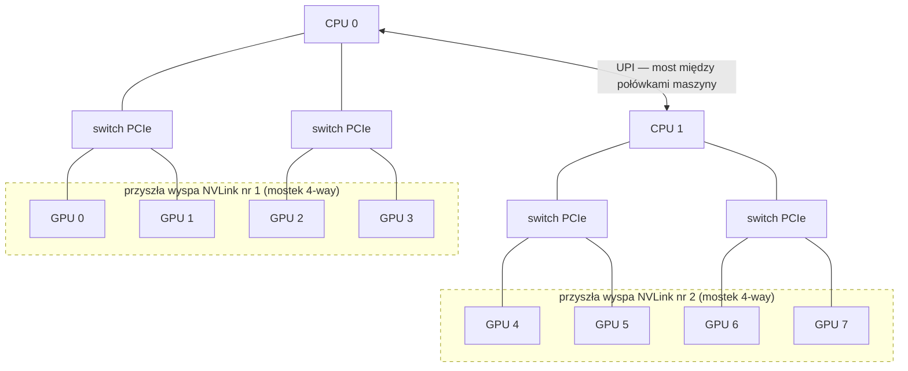
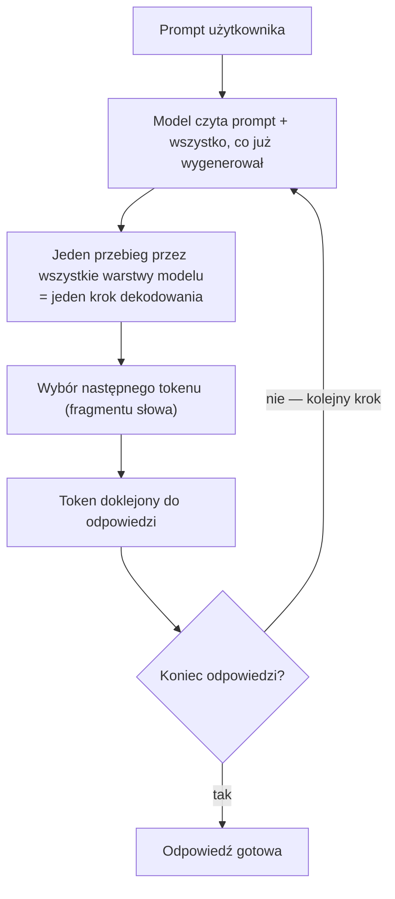
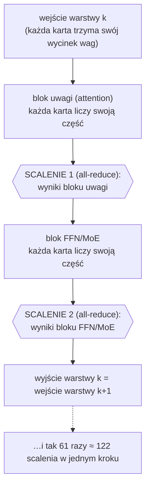
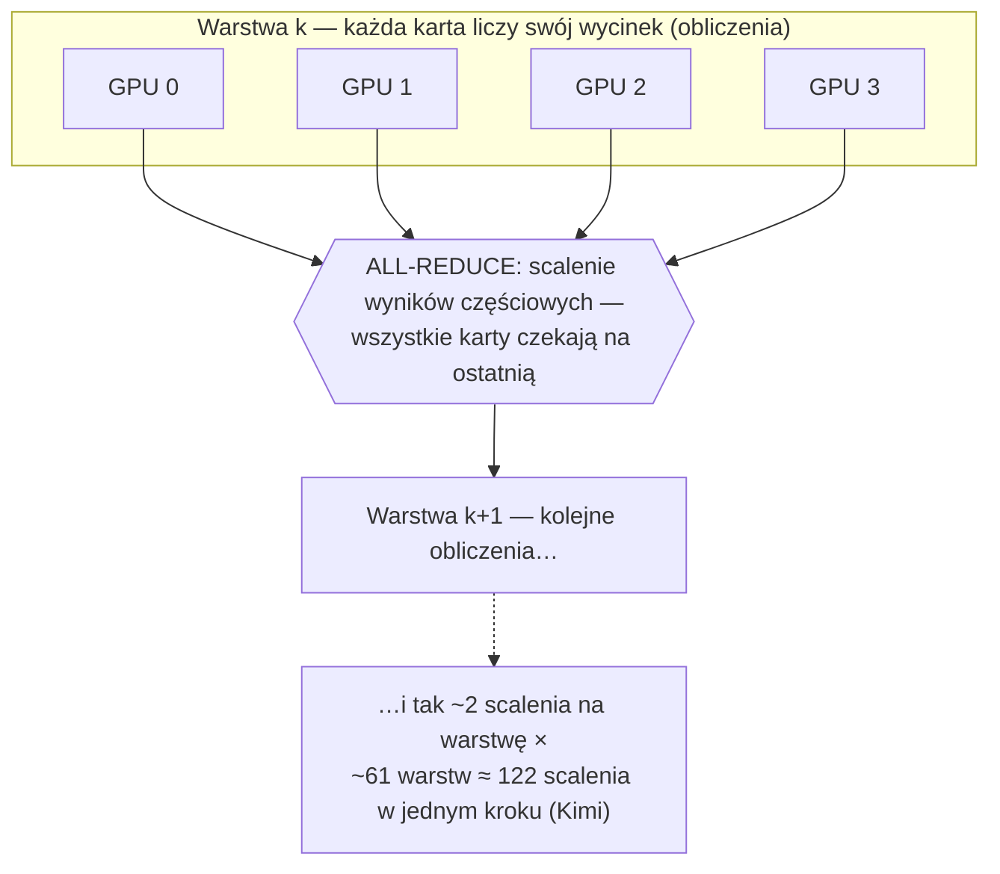
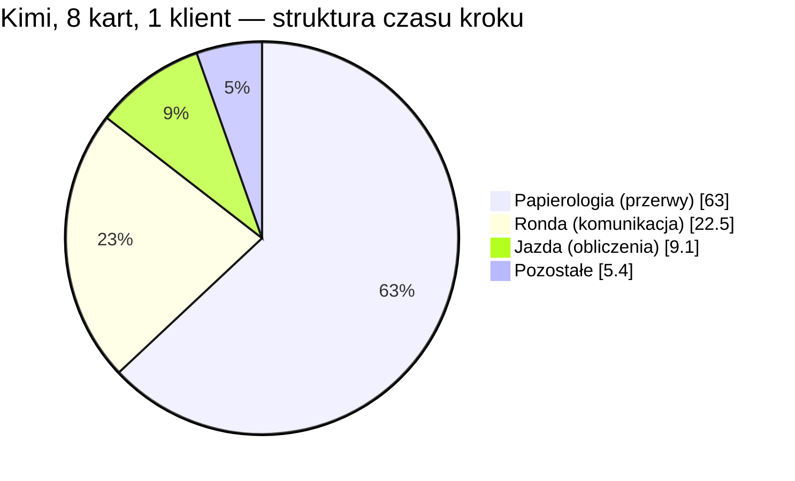
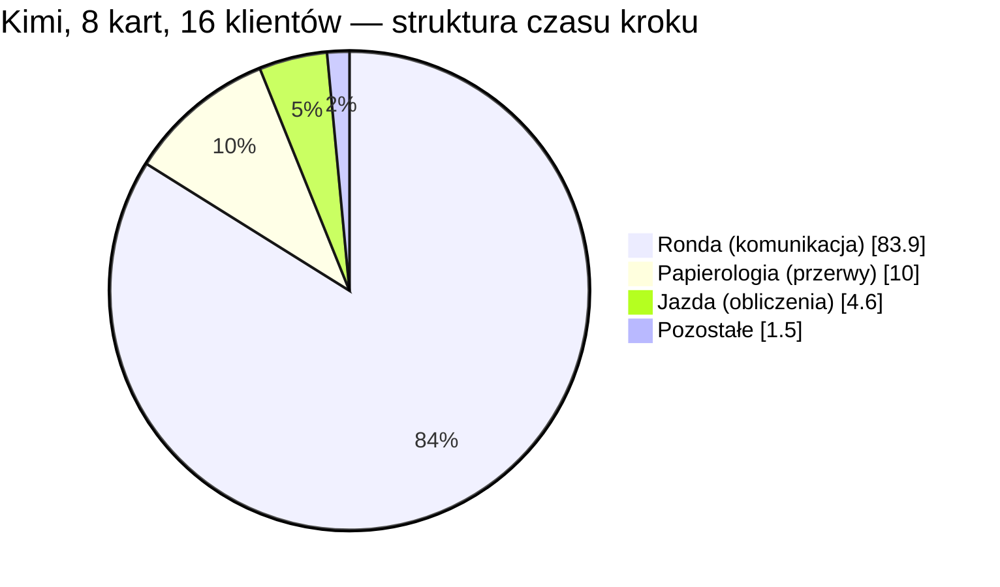

# Zasadność zakupu mostków NVLink 4-way dla węzła 8×H200: przegląd opłacalności w wybranych scenariuszach

## 1. Podsumowanie

Z przeprowadzonych pomiarów i obliczeń wynika, że zakup mostków NVLink
4-way jest zasadny tylko wtedy, gdy serwer ma równolegle obsługiwać wiele
zapytań na modelu, którego wagi wymagają rozłożenia na co najmniej 4 karty
GPU. W tym trybie pracy zmierzony oczekiwany zysk wynosi **2–3×
przepustowości generowania** — łącznej liczby tokenów produkowanych na
sekundę dla wszystkich klientów (teoretyczne maksimum to zysk około
6-krotny). Przy obsłudze pojedynczych zapytań (jeden czat „na żywo"),
nawet na modelu zajmującym 4–8 kart, zysk jest pomijalny (≤1,3×), a dla
modeli mieszczących się na 1–2 kartach GPU zysku nie ma wcale (~0).

Jako kryterium decyzji przyjęto prawo Amdahla, stosowane w obliczeniach
równoległych do wyznaczania teoretycznej górnej granicy przyspieszenia.
Mówi ono, że inwestycja przyspiesza tylko tę część pracy, której fizycznie
dotyczy. NVLink jest szybszym od PCIe łączem między kartami GPU, skraca
więc wyłącznie czas komunikacji między nimi. Jeżeli komunikacja zajmuje
ułamek `s` czasu pojedynczego kroku generowania (czym jest krok — sekcja
4), to nawet nieskończenie szybkie łącze przyspieszy całość najwyżej
`1/(1−s)` razy (obliczenia: sekcja 7). Decyzja o zakupie sprowadza się
zatem do pomiaru, jaką część czasu kroku serwer spędza na komunikacji.
Pomiar tej wielkości jest przedmiotem niniejszej notatki, a odpowiedź
zależy od trybu pracy serwera:

- równoległa obsługa wielu zapytań przez model zajmujący 8 kart:
  komunikacja zajmuje **84%** czasu kroku (sekcja 6d);
- równoległa obsługa wielu zapytań przez model zajmujący 4 karty: **53%**
  (sekcja 6d);
- obsługa jednego zapytania na raz przez model zajmujący 8 kart: **22%**
  (sekcja 6d) — resztę pochłania stały narzut silnika serwującego, więc
  nawet idealne łącze dałoby ≤1,3×;
- obsługa jednego zapytania na raz przez model zajmujący 4 karty: **~15%**
  (1,56 ms na kroku 10,54 ms; sekcja 6b) — zysk ≤1,2×;
- model zajmujący 1–2 karty, niezależnie od liczby równoległych zapytań:
  komunikacja kosztuje ≤1 ms na kroku ~10 ms (sekcja 6b), a nawet jej
  celowe pogorszenie (eksperyment z objazdem ruchu między kartami przez
  pamięć procesora; sekcja 6c) zmienia przepustowość o mniej niż 1% —
  nie ma czego skracać.

Poniżej zestawiono zbadane scenariusze. Kolumna **TP** podaje, na ile kart
podzielony jest model (wyjaśnienie w sekcjach 3–4), a **c (współbieżność)**
— ilu klientów serwer obsługuje jednocześnie: c=1 to jedna rozmowa na
żywo, c=64 — dziesiątki równoległych zapytań (np. kilka czatów na żywo
plus agenci programistyczni utrzymujący po kilka zapytań naraz). Zyski
wynikają z prawa Amdahla zasilonego pomiarami: udział komunikacji w czasie
kroku zmierzono profilerem (sekcja 6d), a współczynnik `capture` — jaka
część komunikacji faktycznie trafi na NVLink — testami rozmieszczenia kart
(sekcje 6c i 7).

| Scenariusz | TP | Ruch | Decyzja | Zysk | Podstawa pomiarowa |
|---|---|---|---|---|---|
| model mieści się na 1–2 kartach (klasa ~35B) | 1–2 | dowolny | nie kupuj | ≈ 0 | podatek komunikacyjny TP2 na granicy szumu pomiaru; celowe pogorszenie łącza bez efektu (6b, 6c) |
| model krojony na ≥4 karty, choć mieści się na mniej | 4–8 | dowolny | nie kupuj — popraw konfigurację | — | TP8 w szczycie 437 tok/s vs 1404 na TP2 (6b) |
| model wymaga 4 kart (klasa ~70–200 mld parametrów), czat na żywo | 4 | c=1 | nie kupuj | znikomy | podatek komunikacyjny 1,56 ms na kroku 10,54 ms (6b) |
| model wymaga 4 kart, wielu klientów | 4 | c=64 | kupuj | ~2,1× | komunikacja = 53,3% czasu kroku (profil Qwen TP4), capture 1,0 (6d, 7) |
| model wymaga 8 kart (Kimi, ~554 GB wag), czat na żywo | 8 | c=1 | nie kupuj | ≤1,2–1,3× | komunikacja = 22,5% czasu kroku (profil Kimi) (6d, 7) |
| model wymaga 8 kart (Kimi), wielu klientów | 8 | c≥8 | kupuj | ~2,7× (maks. 6,2×) | komunikacja = 83,9% czasu kroku (profil Kimi przy c=16), capture 0,75 (6d, 7) |


## 2. Przedmiot i cel badania

Przedmiotem badania jest serwer Supermicro SYS-521GE-TNRT wyposażony w dwa
procesory Intel Xeon Gold 6530 oraz osiem kart NVIDIA H200 NVL (143 GB
pamięci HBM3e na kartę). Karty komunikują się wyłącznie przez magistralę
PCIe Gen5 — w topologii czterech przełączników po dwie karty, bez NVLink
i bez NVSwitch (pełny schemat na diagramie niżej). Modele językowe serwuje
na nim silnik vLLM v0.20 uruchomiony w kontenerach Docker i udostępnia je
użytkownikom przez API.

Badaniu podlegają trzy składniki procesu generowania odpowiedzi na tym
serwerze: **czas pojedynczego kroku generowania** (to on decyduje
o szybkości odpowiedzi), **komunikacja między kartami po PCIe** (jedyne,
co zmieniłby zakup NVLink) oraz **stały narzut silnika serwującego** —
czas, który silnik zużywa przy każdym kroku na czynności organizacyjne
(ustalenie, które zapytania wejdą do bieżącego kroku, wybór kolejnego
fragmentu tekstu, wymiana poleceń między procesorem a kartami),
niezależnie od liczby kart i jakości łącz. Ten narzut to druga możliwa
przyczyna spowolnień: jeśli to ona dominuje, dodanie szybszego łącza nie
przyspieszy serwera.

Głównym serwowanym modelem jest Kimi-K2.6 — model otwarty (open-weight) o około bilionie parametrów (1T), który w publicznym benchmarku zadań programistycznych SWE-bench Verified osiąga wyniki porównywalne z czołowymi modelami komercyjnymi. Rozmiar modelu — około 554 GB samych wag — wymusza pracę na wszystkich ośmiu kartach GPU jednocześnie (obliczenia: sekcja 4).

Pozycję modelu w stawce ilustruje poniższe zestawienie:

| Model | SWE-bench Verified | Źródło |
|---|---:|---|
| Claude Opus 4.8 | 88,6% | [benchlm.ai](https://benchlm.ai/benchmarks/sweVerified) |
| GPT-5.3-Codex | 85,0% | [tokenmix.ai](https://tokenmix.ai/blog/swe-bench-2026-claude-opus-4-7-wins) |
| Gemini 3.1 Pro | 80,6% | [tokenmix.ai](https://tokenmix.ai/blog/swe-bench-2026-claude-opus-4-7-wins) |
| **Kimi-K2.6 (serwowany tutaj)** | **80,2%** | [tokenmix.ai](https://tokenmix.ai/blog/kimi-k2-6-code-preview-review-2026) |

*(Wyniki z publicznych zestawień, stan: czerwiec 2026; służą wyłącznie
umiejscowieniu modelu w stawce — nie były mierzone w tym projekcie.)*

Punktem wyjścia badania była obserwacja, że pod pełnym obciążeniem — gdy
licznik GPU-Util z popularnego narzędzia `nvidia-smi` wskazuje 100% —
żaden zasób serwera nie zbliża się do nasycenia: pamięć HBM jest aktywna
przez 7–9% czasu, jednostki obliczeniowe przez ~20%, łącze PCIe przenosi
~10% swojej przepustowości, a pobór mocy sięga ~30% limitu (pomiary:
sekcja 6a). Mimo to opóźnienie między generowanymi tokenami rośnie wraz
z liczbą równolegle obsługiwanych klientów, a dołożenie kolejnych kart
dodatkowo je pogarsza. Standardowa diagnostyka, polegająca na
poszukiwaniu nasyconego zasobu, nie wskazuje tu więc żadnej przyczyny.

Pozorna sprzeczność między wskazaniem „100% zajętości" a niskim
wykorzystaniem zasobów wynika ze sposobu pomiaru. Licznik GPU-Util
informuje jedynie, że karta ma w danej chwili przydzielone zadanie — nie
mówi nic o tym, czy zadanie to wykonuje obliczenia, czy czeka na dane.
Stan faktyczny pokazuje dopiero telemetria sprzętowa DCGM (sekcja 3),
z której pochodzą przytoczone wyżej odczyty: karty przez większość czasu
nie wykonują obliczeń, lecz na coś czekają. Ustaleniu, na co czekają,
poświęcona jest dalsza część notatki.

Producent serwera przewiduje dla tej maszyny opcjonalne rozszerzenie:
mostki NVLink (w karcie katalogowej: *„GPU-GPU interconnect: NVIDIA NVLink
Bridge, optional"*). Mostek 4-way łączy cztery sąsiednie karty w „wyspę"
z bezpośrednim łączem GPU↔GPU:

| parametr | PCIe Gen5 x16 (stan obecny) | NVLink Bridge (H200 NVL) |
|---|---|---|
| przepustowość dwukierunkowa GPU↔GPU | 128 GB/s | 900 GB/s (**~7×**) |
| opóźnienie pojedynczej wymiany GPU↔GPU | ~20 µs | ~2 µs (**~10×**) |
| droga sygnału | GPU → switch PCIe (czasem → CPU → UPI) → GPU | bezpośrednio GPU↔GPU wewnątrz wyspy; między wyspami nadal PCIe/UPI |

Przepustowości podano zgodnie z [kartą katalogową NVIDIA H200 NVL](https://www.pny.com/file%20library/company/support/linecards/data-center-gpus/h200-nvl-datasheet.pdf).
Opóźnienia nie są publikowane oficjalnie — wartości oszacowano na
podstawie [pomiarów publicznych](https://intuitionlabs.ai/articles/nvidia-nvlink-gpu-interconnect)
(transfery P2P na kartach A100: ~2 µs przez NVLink wobec ~20 µs przez
PCIe 4.0). Niższe opóźnienie wynika stąd, że sygnał NVLink omija switch
PCIe i procesor. Nasuwa się zatem przypuszczenie, że serwer czeka na
komunikację między kartami i że problem rozwiąże szybsze łącze.

Celem niniejszej notatki jest ocena, czy taki zakup jest zasadny —
osobno dla każdego z typowych scenariuszy użycia serwera.



Diagram przedstawia topologię połączeń serwera według karty katalogowej
Supermicro SYS-521GE-TNRT, potwierdzonej zrzutem konfiguracji z działającej
maszyny (źródła: sekcja 10). Dwa procesory komunikują się ze sobą przez
łącze UPI; do każdego z nich podłączone są dwa switche PCIe, a do każdego
switcha — dwie karty GPU. Przerywane ramki oznaczają wyspy NVLink, które
powstałyby po zakupie mostków. Jak wspomniano wcześniej, rozmiar wag
modelu Kimi-K2.6 wymusza pracę na wszystkich ośmiu kartach jednocześnie.
W takiej konfiguracji komunikacja staje się hierarchiczna: mostki przejmą
scalanie wyników wewnątrz każdej z wysp, natomiast wymiana między wyspami
nadal będzie odbywać się przez PCIe i łącze UPI (operację scalania
wyników — all-reduce — opisuje sekcja 4). Pojęcia UPI, switch PCIe
i wyspa NVLink wyjaśnia słowniczek w sekcji 3.

## 3. Słowniczek

Pojęcia zebrano w grupy tematyczne.

**Sprzęt i połączenia**

- **GPU (karta)** — procesor o tysiącach rdzeni wykonujący obliczenia
  modelu; w tym serwerze 8 kart H200 po 143 GB pamięci.
- **HBM** — szybka pamięć umieszczona na karcie; z niej GPU czyta wagi
  modelu w każdym kroku. Licznik `DRAM_ACTIVE` podaje ułamek czasu,
  w którym interfejs tej pamięci faktycznie przesyła dane (miara
  wykorzystania przepustowości, nie zapełnienia pojemności).
- **PCIe** — magistrala łącząca karty GPU z procesorami oraz karty między
  sobą; w badanym serwerze cała komunikacja między kartami odbywa się
  przez PCIe.
- **switch PCIe** — układ rozdzielający jedno łącze PCIe procesora na
  kilka urządzeń; w tym serwerze pracują cztery switche, po dwie karty
  GPU na każdym.
- **UPI (Ultra Path Interconnect)** — łącze między dwoma gniazdami
  procesorów w serwerach dwuprocesorowych Intela. Komunikacja między
  kartami podłączonymi do różnych procesorów przebiega trasą:
  switch PCIe → procesor 1 → UPI → procesor 2 → switch PCIe.
- **NVLink / wyspa** — opracowane przez NVIDIA bezpośrednie łącze
  GPU↔GPU. Mostek (bridge) 4-way łączy cztery sąsiednie karty w „wyspę",
  wewnątrz której komunikacja odbywa się bezpośrednio między kartami,
  z pominięciem switchy PCIe i procesorów (parametry: sekcja 2).

**Równoległość i komunikacja**

- **TP (tensor parallelism)** — podział każdej macierzy wag modelu między
  N kart; każda karta liczy wycinek każdej warstwy. Wyniki częściowe
  trzeba scalać dwukrotnie w każdej warstwie: po bloku uwagi (attention)
  i po bloku FFN/MoE; operacje działające na każdym elemencie niezależnie
  (np. normalizacje) scalania nie wymagają.
- **rank** — jedna karta w zespole TP (TP=8 → 8 ranków).
- **all-reduce** — operacja scalająca wyniki częściowe: każda karta wnosi
  swój fragment i każda kończy z pełną sumą. Operacja jest synchroniczna
  — żadna karta nie kontynuuje obliczeń, dopóki nie skończy ostatnia.
- **NCCL (NVIDIA Collective Communications Library)** — biblioteka
  operacji zbiorowych (all-reduce, all-gather i in.) dla grup GPU; sama
  dobiera trasę transferu (P2P po PCIe, NVLink, przez pamięć hosta)
  i algorytm scalania (np. pierścień). W profilach „czas w NCCL" obejmuje
  transfer danych oraz oczekiwanie na karty, które dotarły do scalenia
  później.
- **P2P (peer-to-peer)** — bezpośrednia wymiana danych między dwiema
  kartami po PCIe, z pominięciem pamięci procesora; jej wyłączenie
  (`NCCL_P2P_DISABLE=1`) wymusza przesyłanie wszystkich danych przez
  pamięć hosta.

**Rozliczanie czasu**

- **token** — najmniejsza porcja tekstu (zwykle fragment słowa), jaką
  model produkuje naraz.
- **krok dekodowania** — jeden pełny przebieg modelu dający kolejny token
  (ze spekulacją: ~2–3 tokeny).
- **TPOT / ITL** — średni czas przypadający na token / odstęp między
  kolejnymi porcjami tokenów. Ze spekulacją ITL ≈ czas kroku (tokeny
  przychodzą seriami), a TPOT dzieli czas kroku przez wszystkie
  wygenerowane tokeny.
- **c (współbieżność)** — liczba zapytań obsługiwanych równolegle; c=1
  odpowiada jednej rozmowie na żywo, c=64 — sześćdziesięciu czterem
  równoległym zapytaniom.
- **spekulacja (MTP / Eagle3)** — mały, tani model proponuje kilka
  kolejnych tokenów naprzód, a duży model weryfikuje je wszystkie
  w jednym kroku; przy średniej akceptacji ~2,6 każdy krok daje
  ~2,6 tokenu.
- **CUDA Graphs (cudagraphs)** — mechanizm CUDA pozwalający jednorazowo
  nagrać sekwencję operacji GPU składających się na krok, a następnie
  uruchamiać całą sekwencję jednym poleceniem. Bez niego procesor zleca
  każdą z tysięcy operacji kroku osobno, a samo zlecenie kosztuje
  pojedyncze mikrosekundy — przy nagranym grafie ten koszt znika z czasu
  kroku (pomiar wpływu: sekcja 6e).
- **stały narzut kroku (`F_host`)** — koszt płacony przy każdym kroku
  niezależnie od liczby kart i jakości łącz: ustalenie składu kroku
  (które zapytania do niego wejdą), wybór kolejnego tokenu, obsługa
  spekulacji, synchronizacje CPU↔GPU.
- **prawo Amdahla** — przyspieszając część stanowiącą ułamek `s` całości,
  całość przyspieszymy najwyżej `1/(1−s)` razy, choćby ta część stała się
  nieskończenie szybka.
- **capture** — udział komunikacji, który po zakupie mostków faktycznie
  odbywałby się przez NVLink. NCCL wykonuje all-reduce algorytmem
  pierścienia: karty tworzą logiczny okrąg (0→1→…→7→0), każda wysyła
  dane wyłącznie do następnej, a pełne scalenie wymaga przejścia danych
  przez wszystkie odcinki okręgu — przy 8 kartach jest ich 8, z ruchem
  rozłożonym na nie równomiernie. Po podziale na wyspy 0–3 i 4–7 sześć
  odcinków leży wewnątrz wysp i przejmie je NVLink, a dwa (3→4 i 7→0)
  przekraczają granicę wysp i pozostają na PCIe/UPI — stąd dla TP=8
  capture = 6/8 = 0,75. Dla TP≤4 cały pierścień mieści się w jednej
  wyspie: capture = 1,0.

**Pomiar**

- **liczniki DCGM** — telemetria sprzętowa NVIDII: `SM_ACTIVE` (ułamek
  czasu, w którym rdzenie wykonują pracę), `DRAM_ACTIVE` (jak wyżej),
  `PCIE_RX/TX` (bajty na sekundę na łączu).
- **GPU-Util (`nvidia-smi`)** — licznik zajętości pokazujący 100%, gdy
  karta ma przydzielone jakiekolwiek zadanie — niezależnie od tego, czy
  wykonuje ono obliczenia, czy czeka na dane.
- **profiler / trace** — zapis każdej operacji GPU na osi czasu; pozwala
  podzielić czas kroku na komunikację, obliczenia i przerwy.
- **gap (przerwa)** — odcinek czasu, w którym GPU nie wykonuje żadnej
  operacji, oczekując na decyzje hosta.
- **interwencja kontrolowana (dose–response)** — test przyczynowy: celowe
  pogorszenie podejrzanego elementu układu i sprawdzenie, czy wynik
  pogarsza się proporcjonalnie; brak efektu wyklucza dany mechanizm jako
  przyczynę.

## 4. Mechanizm generowania tekstu i składniki czasu kroku

Model językowy generuje odpowiedź w pętli. W każdej iteracji czyta
wszystko, co dotąd powstało (zapytanie i dotychczas wygenerowany tekst),
wykonuje jeden pełny przebieg przez wszystkie swoje warstwy i wybiera
**jeden** następny token — w przybliżeniu fragment słowa. Token zostaje
dodany do tekstu i pętla zaczyna się od nowa; odpowiedź o długości
500 tokenów to ~500 takich przebiegów. Jeden przebieg nazywa się **krokiem
dekodowania** — czas kroku, powtórzony setki razy, decyduje o szybkości
generowania odpowiedzi.



Dla dalszych obliczeń istotne jest jedno rozszerzenie tej pętli: serwer
używa **dekodowania spekulacyjnego** (na Kimi: algorytm **Eagle3**).
Obok dużego modelu pracuje mały model pomocniczy, który proponuje kilka
kolejnych tokenów z wyprzedzeniem; duży model w jednym kroku weryfikuje cały
szkic i akceptuje te tokeny, które pokrywają się z jego własnym wyborem.
W pomiarach Kimi akceptuje średnio **~2,6–2,7 tokenu na krok** (odczyt
z logów silnika, stabilny we wszystkich oknach pomiarowych —
sekcja 6d). Spekulacja
zmienia więc arytmetykę — krok jest droższy o weryfikację, ale daje
średnio ~2,6 tokenu zamiast jednego — nie zmienia jednak natury pętli.

Druga istotna własność: największe modele **nie mieszczą się na jednej
karcie**. Kimi-K2.6 to ~554 GB wag przy ~140 GB użytkowej pamięci karty —
nawet po podziale na 4 karty same wagi zajęłyby ~138,6 GB na kartę i nie
zostałoby miejsca na nic innego; dlatego model musi pracować na
wszystkich ośmiu kartach jednocześnie. Technika podziału nazywa się
**tensor parallelism (TP)**: każda karta przechowuje i liczy wycinek
każdej warstwy. Ceną podziału jest komunikacja — po bloku uwagi i po
bloku FFN/MoE każdej warstwy karty muszą **scalić wyniki częściowe**
(operacja all-reduce), a scalenie jest synchroniczne: żadna karta nie
kontynuuje obliczeń, dopóki nie skończy ostatnia. Kimi-K2.6 ma ~61
warstw (z konfiguracji architektury modelu), co daje **~122 obowiązkowe
scalenia w każdym kroku** (2 × 61).

Budowa jednej warstwy pod TP i miejsca obu scaleń:



Samo scalenie z bliska — synchronizacja wszystkich kart:



Czas kroku rozkłada się zatem na trzy składniki:

```text
T(krok) = F_host + N_rounds × r(łącze, liczba kart) + W_silicon
```

gdzie: `F_host` — stały narzut kroku (sekcja 3); `N_rounds` — liczba
synchronicznych rund komunikacji w kroku (~122 dla Kimi, jak wyżej);
`r(łącze, liczba kart)` — czas jednej rundy, zależny od transportu (dziś
PCIe, po zakupie NVLink) i rosnący z liczbą uczestników; `W_silicon` —
czas właściwych obliczeń: odczyty wag z pamięci HBM i arytmetyka.

Każdy z trzech składników może być wąskim gardłem i każdy zostawia
**inny ślad w pomiarach**, co pozwala ustalić przyczynę spowolnień
na podstawie pomiarów:

1. **Zbyt wolna pamięć** (`W_silicon`) — karta czeka na odczyt wag
   z HBM. Ślad: wysoki `DRAM_ACTIVE`.
2. **Zbyt kosztowna komunikacja** (`N_rounds × r`) — czas pochłaniają
   scalenia. Ślady: czas kroku rośnie z liczbą kart; w profilu czasowym
   dominuje komunikacja; łącze PCIe osiąga granicę przepustowości, choć
   rdzenie są bezczynne.
3. **Zbyt duży stały narzut** (`F_host`) — silnik serwujący kosztuje
   niezależnie od sprzętu. Ślady: krok jest kosztowny nawet na jednej
   karcie (zero komunikacji); w profilu dominują przerwy, w których GPU
   nie wykonuje żadnej operacji.

## 5. Metodologia pomiarowa

**Zmienna kontrolowana: liczba kart (krzywa TP).** Qwen3.6-35B-A3B mieści
się w całości na jednej karcie, można go więc uruchamiać w konfiguracjach
TP=1/2/4/8 przy identycznych pozostałych parametrach silnika.
Konfiguracja TP=1 nie wykonuje żadnej komunikacji między kartami
i stanowi punkt odniesienia; każda dodatkowa milisekunda czasu kroku przy
TP=2/4/8 jest więc w całości kosztem równoległości (zdominowanym przez
operacje all-reduce). W przypadku Kimi-K2.6 takie porównanie nie jest
możliwe — model wymaga TP=8 — dlatego podział jego czasu kroku ustalono
bezpośrednio z profilu czasowego, a krzywą TP dostarcza model kontrolny
Qwen.

**Interwencje kontrolowane.** Każdą hipotezę testowano, celowo degradując
jeden podejrzany element przy niezmienionej reszcie układu:

- `NCCL_P2P_DISABLE=1` — przekierowanie każdego transferu między kartami
  przez pamięć hosta, czyli degradacja ścieżki P2P (wyniki: sekcja 6c);
- testy rozmieszczenia kart — ten sam zespół kart rozdzielony na dwie
  połówki maszyny (`CUDA_VISIBLE_DEVICES=0,4` dla TP2 oraz `0,1,4,5`
  dla TP4), czyli zmiana klasy łącza bez zmiany liczby kart (wyniki:
  sekcja 6c);
- wyłączanie składników stałego narzutu — spekulacja wyłączona,
  CUDA Graphs wyłączone (tryb eager), governor CPU przełączony w tryb
  `performance` (wyniki: sekcja 6e).

Kryterium przyczynowości: jeśli podejrzany mechanizm rzeczywiście
odpowiada za czas kroku, jego kontrolowana degradacja musi mierzalnie ten
krok wydłużyć; brak efektu wyklucza mechanizm — niezależnie od tego, jak
dobrze pasował do objawów.

**Trzy instrumenty pomiarowe:**

- metryki po stronie klienta — `vllm bench serve`: czas do pierwszego
  tokenu, TPOT/ITL, przepustowość; każdy pomiar poprzedzono rozgrzewką;
- liczniki sprzętowe — DCGM (`dcgmi dmon`, próbkowanie co 1 s),
  uśredniane wyłącznie wewnątrz okna benchmarku wyznaczanego znacznikami
  czasu;
- profil czasowy — torch profiler: pełna oś czasu operacji GPU, z której
  liczone są udziały komunikacji, obliczeń i przerw.

**Kontrole rzetelności:**

- pasmo szumu pomiaru: ±0,4 ms na kroku, skalibrowane na trzech
  niezależnych startach silnika w identycznej konfiguracji; mierzone
  dalej efekty są wielokrotnie większe — podatek komunikacyjny TP4
  (+1,56 ms) to ~4-krotność pasma szumu, TP8 (+5,18 ms) — ~13-krotność;
- kontrola narzutu profilera: dla każdego profilu wykonano pomiar
  porównawczy bez profilera; różnice wyniosły 2–8%, więc oś czasu
  odzwierciedla rzeczywiste zachowanie silnika;
- odtwarzalność anomalii: pomiary anomalne powtórzono od zera, łącznie
  z ponownym utworzeniem kontenera silnika (zgodność w granicach ±3%);
- weryfikacja konfiguracji: przed każdym pomiarem sprawdzano faktyczne
  TP w logu silnika, rozmieszczenie kart w zmiennych środowiskowych
  kontenera i włączenie profilera w konfiguracji procesu; wykryto tą
  drogą trzy pomyłki konfiguracyjne, zanim zdążyły zniekształcić wyniki.

## 6. Wyniki pomiarów

### 6a. Ładownia niewinna — pierwszy podejrzany odpada od razu

Konfiguracja pomiaru: produkcyjny stack Kimi-K2.6 (TP=8, spekulacja
Eagle3 włączona, vLLM v0.20), trzy okna pomiarowe — bieg jałowy, 1 klient
(c=1) i 64 klientów (c=64); liczniki DCGM próbkowane co 1 s i uśredniane
wyłącznie wewnątrz okna danego benchmarku, wartości per karta.

Gdyby krok był ograniczony czytaniem wag z pamięci, licznik `DRAM_ACTIVE`
siedziałby przy 70–90%. Zmierzone wartości pod obciążeniem:

| okno pomiaru | pobór mocy / kartę | SM_ACTIVE | DRAM_ACTIVE | PCIe (GB/s) |
|---|---:|---:|---:|---:|
| bieg jałowy | ~99 W | 0,000 | 0,000 | ~0 |
| 1 klient (c=1) | ~170 W | 0,21 | 0,093 | 1,9 / 6,0 |
| 64 klientów (c=64) | ~199 W | 0,20 | 0,070 | 6,0 / 8,0 |

*Surowe dane:
[`p0_gpu_counters`](../../../results/runs/2026-06-10_w1_article_evidence/p0_gpu_counters/).*

*Jak czytać:* pamięć pracuje przez 7–9% czasu — hipoteza „za wolna
ładownia" jest obalona pierwszym pomiarem. Zostaje pytanie: ronda czy
papierologia?

### 6b. Krzywa TP: więcej kart = wolniej

Konfiguracja pomiaru: sonda Qwen3.6-35B-A3B, identyczna komenda silnika
dla wszystkich biegów — zmienia się wyłącznie liczba kart
(`--tensor-parallel-size` 1/2/4/8), spekulacja MTP włączona; obciążenie
z `vllm bench serve` na stałym zestawie promptów (40 zapytań przy c=1,
600 przy c=64, 2 rozgrzewki); faktyczne TP weryfikowane z logu silnika
przed każdym biegiem. Surowe dane:
[`qwen_tp_curve`](../../../results/runs/2026-06-11_bottleneck/qwen_tp_curve/).

Najpierw pojedynczy klient (c=1) — każdy kurs widać jak na dłoni:

| karty (TP) | czas kroku (ms) | TPOT (ms) | podatek komunikacyjny vs 1 karta |
|---|---:|---:|---:|
| 1 | 8,98 | 3,68 | — (punkt odniesienia: zero komunikacji) |
| 2 | 9,91 | 3,65 | +0,93 ms |
| 2 (karty po dwóch stronach maszyny) | 9,13 | 3,51 | +0,15 ms |
| 4 | 10,54 | 4,00 | +1,56 ms |
| 8 | 14,16 | 5,12 | +5,18 ms |

*Jak czytać:* czas kroku to odstęp między porcjami tokenów (ITL). Podatek
od rond rośnie **szybciej niż liniowo** z liczbą furgonetek: przejście 2→4 karty
kosztuje +0,6 ms, ale 4→8 już +3,6 ms — każde rondo musi zsynchronizować
więcej uczestników. Wiersz „po dwóch stronach maszyny" to zapowiedź sekcji
6c: trasa przez najgorszą klasę drogi (most UPI) okazała się *nie droższa*
od trasy po wspólnym switchu.

Teraz pełna sala (c=64) — reżim przepustowości. Efektywność skalowania =
zmierzony wynik ÷ (wynik 1 karty × liczba kart), czyli „jaki ułamek
dołożonego sprzętu zamienia się w produkt":

| karty (TP) | przepustowość (tok/s) | efektywność skalowania | moc / SM_ACTIVE na kartę | PCIe RX (GB/s) |
|---|---:|---:|---|---:|
| 1 | 1202 | 100% (def.) | 436 W / 0,665 | ~0 |
| 2 | **1404** | 58% | 255 W / 0,359 | 6,25 |
| 4 | 680 | 14% | 142 W / 0,118 | 5,65 |
| 8 | 257 | 2,7% | 111 W / 0,053 | 7,18 |

*Jak czytać:* efektywność skalowania liczy się wprost z tabeli, np. dla
TP=2: 1404 ÷ (1202 × 2) = 58% — już tu 42% mocy obliczeniowej drugiej
karty pochłania koordynacja, choć 2 karty pozostają optimum absolutnym
(+17% przepustowości względem jednej). Od TP=4 zaczyna się regres:
konfiguracje 4 i 8 kart są **absolutnie wolniejsze niż jedna karta** —
osiem kart
dostarcza 21% tego, co jedna (257 vs 1202 tok/s), więc dołożenie siedmiu
kart obniża wynik zamiast go poprawić. Liczniki wskazują przyczynę: pobór
mocy na kartę spada z 436 W w stronę biegu jałowego (~99 W), a `SM_ACTIVE`
obniża się z 0,665 do 0,053 — karty nie liczą szybciej na mniejszych
wycinkach, tylko **stoją na rondach**, czekając w synchronicznych
scaleniach na resztę konwoju. Warto też porównać kolumnę PCIe RX: TP=8
osiąga sufit transportu (7,18 GB/s — sekcja 6c), a TP=4 (5,65 GB/s)
jeszcze do niego nie dociera — przy 4 kartach ogranicza już sama
synchronizacja rosnącej liczby uczestników, zanim w ogóle zabraknie
przepustowości łącza.

### 6c. Nie którędy jeżdżą, ale ile furgonetek — klasa drogi uniewinniona

Konfiguracja pomiaru: sonda Qwen jak w 6b; rozmieszczenie kart wymuszane
przez `CUDA_VISIBLE_DEVICES` i weryfikowane z env kontenera przed każdym
biegiem; degradacja ścieżki P2P przez `NCCL_P2P_DISABLE=1` (wymagane przy
tym restarty silnika posłużyły zarazem do kalibracji pasma szumu
z sekcji 5).

W połowie śledztwa mieliśmy „oczywistego" winnego: most UPI między
procesorami. Zespół 8 kart musi przez niego jeździć, zespół 4 kart nie —
to tłumaczyłoby przepaść TP4→TP8. Hipotezę zabiły trzy dawki:
| dawka | konfiguracja | wynik |
|---|---|---|
| konwój 2 kart przez most UPI | GPU 0 + GPU 4 (dwie połówki maszyny) | c=1: krok 9,13 vs 9,91 ms na wspólnym switchu (≈285 vs 274 tok/s na klienta, przeliczenie z TPOT) — **kary brak** |
| konwój 4 kart na dwóch połówkach | GPU 0,1,4,5 vs GPU 0–3 | c=64: ITL 48,3 vs 53,7 ms → 716 vs 680 tok/s — przez most o ~5% **lepiej** |
| zamknięcie bezpośredniej ścieżki (P2P) | TP2, cały ruch objazdem przez pamięć hosta | c=64: 1396 vs 1404 tok/s; c=1: krok bez zmian (~9,9 ms) — **efekt zerowy** (różnice w paśmie szumu) |

*Surowe dane:
[`qwen_tp_curve`](../../../results/runs/2026-06-11_bottleneck/qwen_tp_curve/)
(wiersze 1 i 3) oraz
[`2026-06-11_nvlink_boundary`](../../../results/runs/2026-06-11_nvlink_boundary/)
(wiersz 2).*

*Jak czytać:* gdyby liczyła się klasa drogi, trasa przez most musiałaby być
najdroższa — a nie jest. Gdyby przy 2 kartach komunikacja cokolwiek
kosztowała, jej radykalne pogorszenie (objazd przez hosta) musiałoby boleć
— a nie boli. O koszcie decyduje **liczba furgonetek w konwoju** i jeden
wspólny sufit: łącze PCIe przybija do **7,2–7,9 GB/s** na kartę w każdej
konfiguracji, która do niego dobije — niezależnie od modelu.

Skąd „sufit" na poziomie 7–8 GB/s, skoro nominalnie PCIe Gen5 x16 to
64 GB/s w jedną stronę? Wartość nominalna dotyczy ciągłego,
jednokierunkowego strumienia danych. Ruch all-reduce wygląda zupełnie
inaczej: to setki krótkich, **synchronicznych** rund na każdy krok,
w których karty czekają na siebie nawzajem (a czekanie nie generuje
bajtów), pakiety są małe i przechodzą przez współdzielone uplinki switchy
oraz pamięć procesorów. Efektywna przepustowość takiego wzorca na tej
topologii okazuje się wynosić ~7–8 GB/s na kartę — i jest to ustalenie
**empiryczne**: każda konfiguracja, która do tej wartości dociera (Kimi
TP8 przy każdym c≥8, Qwen TP8 od c=16 — sekcja 6d), zatrzymuje się na niej
i żadna jej nie przekracza. A dlaczego „więcej się nie da"? Bo rundy są
synchroniczne — następna nie ruszy, zanim nie zakończy się poprzednia —
a fizyczny tor (uplink switcha współdzielony przez dwie karty, przejścia
przez pamięć procesorów) jest w trakcie rundy już w pełni zajęty. Gdy
zapotrzebowanie na transfer dalej rośnie (większe pakiety przy większej
liczbie klientów), dane czekają w kolejce do łącza: przepływ stoi na
suficie, a wydłuża się czas kroku — dokładnie ten obraz pokazują tabele
w 6d. To granica wzorca komunikacji na tym sprzęcie, nie nominalna
granica złącza — dlatego nazywamy ją sufitem transportu.
Dla decyzji zakupowej to kluczowe: wartością NVLink jest **wymiana całego
transportu**, a nie skrócenie jednej pechowej trasy.

### 6d. Dwa różne wąskie gardła — zależnie od ruchu

Najważniejszy wynik badania. Konfiguracja pomiaru: produkcyjny stack
Kimi-K2.6 (TP=8, Eagle3 ON) pod `vllm bench serve` przy c=1/8/16/32
(stały zestaw promptów, 256 tokenów odpowiedzi na zapytanie); okna DCGM
jak w 6a; akceptacja spekulacji odczytywana z logów silnika jest stabilna
(~2,67) we wszystkich oknach, więc żaden z poniższych efektów nie jest
artefaktem spekulacji. Surowe dane:
[`2026-06-11_nvlink_boundary`](../../../results/runs/2026-06-11_nvlink_boundary/)
(ramp i profil przy c=16) oraz
[`kimi_profiler`](../../../results/runs/2026-06-11_bottleneck/kimi_profiler/)
(profil przy c=1).

Najpierw duży Kimi na 8 kartach przy rosnącej liczbie klientów:

| klienci (c) | TPOT (ms) | odstęp między krokami (ms) | przepustowość (tok/s) | moc / SM_ACTIVE | PCIe RX (GB/s) |
|---:|---:|---:|---:|---|---:|
| 1 | 8,7 | (krok ~50 ms, z profilu) | 75 | — | — |
| 8 | 78,5 | 191 | 86 | 135 W / 0,093 | 7,20 |
| 16 | 190,5 | 512 | 73 | 123 W / 0,068 | 7,85 |
| 16 (powtórka) | 197,3 | 525 | 67 | 126 W / 0,074 | 7,66 |
| 32 | 94,1 | 127 | 285 | 185 W / 0,179 | 7,79 |

*Jak czytać:* od c=8 wzwyż transport PCIe jest przybity do sufitu
(7,2–7,9 GB/s) — tego samego, w który uderza sonda Qwen. Punkt c=16 to
osobliwość: serwer pracuje *4× gorzej* niż przy c=32, pobierając mniej
mocy — powtórzyliśmy pomiar od zera (±3%), anomalia jest realna. To
patologia planisty (software): sama zmiana punktu pracy na c=32 usuwa ją
bez wydawania pieniędzy — warto ją rozliczyć przed jakimkolwiek zakupem.

A teraz filmy poklatkowe — struktura czasu jednego kroku:

| film poklatkowy | papierologia (przerwy) | ronda (komunikacja) | jazda (obliczenia) |
|---|---:|---:|---:|
| Kimi, 8 kart, **1 klient** | **63%** | 22,5% | 9,1% |
| Kimi, 8 kart, **16 klientów** | 10% | **83,9%** | 4,6% |
| Qwen, 4 karty, **64 klientów** | 33% | **53,3%** | 5,6% |

*Surowe dane: tekstowe podsumowania trace'ów (rank 0) w
[`kimi_profiler`](../../../results/runs/2026-06-11_bottleneck/kimi_profiler/)
(wiersz 1) oraz
[`2026-06-11_nvlink_boundary`](../../../results/runs/2026-06-11_nvlink_boundary/)
(wiersze 2–3); pełne trace'y pozostają poza repozytorium ze względu na
rozmiar. Kontrola narzutu profilera dla każdego wiersza: 2–8%
(sekcja 5).*





*Jak czytać:* to jest sedno całej notatki. **Przy jednym kliencie** kurs
trwa ~50 ms (wyprowadzenie z profilowanego zapytania: 189 tokenów ÷ ~2,6
tokenu na krok ≈ 73 kroki, faza generowania ~3,8 s → ~50 ms/krok),
z czego 63% to postój z wyłączonym silnikiem (papierologia),
22,5% ronda, 9% jazda — gardłem jest **stały narzut silnika**, nie drogi.
**Przy pełnej sali** struktura się odwraca: 84% czasu na rondach — gardłem
jest **transport**. Ten sam serwer, ten sam model, dwa zupełnie różne
wąskie gardła. Dlatego pytanie „czy kupić NVLink" nie ma jednej odpowiedzi
— ma odpowiedź *per scenariusz*.

**Wiarygodność udziałów.** Udział 53,3% (Qwen, 4 karty) ma niezależne
potwierdzenie rachunkowe. Logika: skoro trace mówi, że komunikacja zjada
53,3% kroku TP4, to usunięcie jej powinno podnieść przepustowość do
680 ÷ (1 − 0,533) ≈ 1456 tok/s — i to jest niemal dokładnie wynik TP2
(1404 tok/s, zgodność ~4%). Spadek przepustowości TP2→TP4 (52%) i udział
komunikacji w trace (53,3%) to więc ta sama wielkość zmierzona **dwiema
niezależnymi metodami** — zegarem po stronie klienta i osią czasu operacji
GPU. Pozostałe przypadki są z tym obrazem spójne: liczniki z 6b (moc
i `SM_ACTIVE` spadające z liczbą kart) opowiadają to samo, co rosnący
udział rond w trace'ach, a sufit transportu 7,2–7,9 GB/s pojawia się
niezależnie w obu modelach (Kimi c≥8 i Qwen TP8). Jedno ograniczenie:
dla udziału 83,9% (Kimi przy c=16) drugiej metody nie ma — Kimi nie może
zejść poniżej TP=8, więc nie istnieje dla niego punkt odniesienia bez
komunikacji; stąd ostrożniejsze traktowanie tej liczby w sekcjach 8 i 9.

### 6e. Z czego składa się papierologia

Skoro przy jednym kliencie rządzi podłoga, rozłożyliśmy ją dawkami
(sonda Qwen na 1 karcie, zero komunikacji):

| dawka | czas kroku (ms) | TPOT (ms) | wniosek |
|---|---:|---:|---|
| pełna konfiguracja | 8,93 | 3,39 | punkt odniesienia |
| spekulacja wyłączona | 5,36 | 5,36 | rytuał spekulacji = 3,57 ms = **40% podłogi** (a mimo to spekulacja się opłaca — wyjaśnienie niżej) |
| cudagraphs wyłączone | 55,1 | 19,6 | nawigacja ukrywała **~46 ms/krok** kosztu startowania operacji (wyjaśnienie niżej) |
| oszczędzanie energii CPU wyłączone | 9,86 | 3,70 | governor **uniewinniony** — zmiana nic nie daje |

**Dlaczego spekulacja się opłaca, skoro czyni krok droższym?** Bez niej
krok jest tańszy (5,36 vs 8,93 ms), ale produkuje dokładnie 1 token. Ze
spekulacją krok kosztuje więcej, lecz akceptacja ~2,6 tokenu na krok
rozkłada ten koszt na więcej paczek: 8,93 ÷ 2,6 ≈ 3,4 ms na token wobec
5,36 ms bez spekulacji (kolumna TPOT). Droższy kurs wożący ~2,6 paczki
wygrywa z tańszym, który wozi jedną.

**Jak cudagraphs „ukrywają" koszt startowania?** Jeden krok to tysiące
drobnych operacji GPU, a samo zlecenie każdej z nich przez procesor
(launch) kosztuje pojedyncze mikrosekundy — sumarycznie ~46 ms na krok,
kilkukrotnie więcej niż cała reszta kroku. Cudagraphs nagrywają całą
sekwencję raz i odtwarzają ją potem jako jedną operację, bez udziału
procesora przy każdym zleceniu. Dawka eager wyłącza to nagranie: krok
eksploduje z 8,93 do 55,1 ms, a `SM_ACTIVE` spada do 0,009 — karta niemal
cały czas czeka, aż procesor zleci kolejną operację. W analogii: bez
nawigacji kierowca gasi silnik i pyta dyspozytora o trasę przed każdym
odcinkiem.

*Jak czytać:* podłoga to nie jedna rzecz, tylko suma nazwanych składników —
największy pojedynczy to księgowość spekulacji (40%), a największy *ukryty*
(koszt startowania tysięcy drobnych operacji) jest już zamaskowany przez
cudagraphs. To wszystko jest **software**: żaden kabel tego nie obniży.

## 7. Rachunek opłacalności

Wracamy do prawa Amdahla, teraz z liczbami. Intuicja: jeśli 20% podróży to
autostrada, to nawet teleportacja na tym odcinku skróci całość najwyżej
o 20% (czyli przyspieszy ją ~1,25×). Nowa autostrada opłaca się tylko temu,
kto większość czasu spędza na odcinku, który ona zastępuje.

Dla NVLink:

```text
zysk ≤ 1 / (1 − s × capture)
```

gdzie `s` to udział rond w czasie kroku (z filmów poklatkowych, sekcja 6d),
a `capture` — część rond, które faktycznie trafią na autostradę (z testów
placementu, sekcja 6c: **1,0** gdy cały konwój mieści się w jednej wyspie,
czyli do 4 kart; **~0,75** dla 8 kart na dwóch wyspach, bo scalenia między
wyspami dalej jadą po PCIe).

```text
2 karty, c=1 i c=64:      s ≈ 0                       → zysk ≈ 1,0× (brak)
4 karty, jeden klient:    1 / (1 − 0,148 × 1,00) ≈ 1,2×   (s = 1,56 / 10,54 ms)
4 karty, obsługa masowa:  1 / (1 − 0,533 × 1,00) ≈ 2,1×
8 kart,  jeden klient:    1 / (1 − 0,225 × 0,75) ≈ 1,2×
8 kart,  obsługa masowa:  1 / (1 − 0,839 × 0,75) ≈ 2,7×   (sufit przy capture=1: 6,2×)
```

Skąd wartości `s`: dla 2 kart — podatek komunikacyjny w paśmie szumu
i zerowy efekt dawki P2P (sekcja 6c; dane:
[`qwen_tp_curve`](../../../results/runs/2026-06-11_bottleneck/qwen_tp_curve/));
dla 4 kart przy c=1 — podatek 1,56 ms na kroku 10,54 ms (sekcja 6b, te
same dane); pozostałe — udziały komunikacji z trace'ów (sekcja 6d; dane:
[`2026-06-11_nvlink_boundary`](../../../results/runs/2026-06-11_nvlink_boundary/)
i [`kimi_profiler`](../../../results/runs/2026-06-11_bottleneck/kimi_profiler/)).

To są **górne granice dla idealnego (nieskończenie szybkiego) łącza**.
Realny NVLink nie zeruje czasu rundy, tylko skraca go ~7× (tyle wynosi
wzrost przepustowości, a w reżimie masowym to ona wycenia rundę —
sekcja 6c). Usuwana jest więc część `s × capture × (1 − 1/7)` kroku,
co daje: 4 karty masowo 1 / (1 − 0,533 × 0,857) ≈ **1,8×** (zamiast
2,1×), 8 kart masowo 1 / (1 − 0,629 × 0,857) ≈ **2,2×** (zamiast 2,7×) —
realny NVLink dowozi więc ~80–90% granicy. Druga poprawka w dół: część
czasu „na rondach" to czekanie na najwolniejszą kartę, którego żadne
łącze nie usuwa; jej udziału nie mierzyliśmy osobno, dlatego notatka
posługuje się granicami z zastrzeżeniami (sekcja 9), a nie jedną
„realną" liczbą.

Na koniec rachunku uczciwość wymaga konfrontacji z szacunkiem, który
zrobiliśmy **przed** pomiarami (zapisanym z góry, żeby nie dało się go
dopasować do wyników):

| konfiguracja | szacunek przed pomiarem | pomiar | gdzie szacunek się mylił |
|---|---|---|---|
| 2 karty | ~1,3–2× | **≈ 0** | komunikacja 2 kart jest ~darmowa — nie ma czego skracać |
| 4 karty | ~1,6–2,5× | ≈0 (1 klient); **~2,1×** (masowo) | szacunek nie rozróżniał kształtu ruchu (c) — a dla tych samych 4 kart zysk to ≈0 przy c=1 i ~2,1× przy c=64; jedna liczba na konfigurację nie istnieje |
| 8 kart | ~1,2–1,5× | ~1,2× (1 klient); **~2,7×** (masowo) | niedoszacowany dokładnie ten reżim, do którego NVLink jest stworzony |

Szacunek „z kartki" pomylił się **w kształcie odpowiedzi**, nie tylko
w liczbach: przeceniał NVLink tam, gdzie rządzi papierologia, i nie doceniał
tam, gdzie rządzi transport. To najmocniejszy argument tej notatki za
zasadą *zmierz, zanim kupisz*.

## 8. Przegląd scenariuszy

| scenariusz | werdykt | szacowany zysk | na czym oparty (sekcja) |
|---|---|---|---|
| model mieści się na 1–2 kartach, dowolny ruch | **NIE KUPUJ** | ≈ 0 | dawka przyczynowa: objazd przez hosta nic nie zmienia, podatek w paśmie szumu (6b, 6c) |
| ≥4 kart dla modelu, który mieści się na mniejszej liczbie | **NIE KUPUJ** (to błąd konfiguracji, nie sprzętu) | — | pomiar krzywej TP: 8 kart = 437 tok/s w szczycie vs 1404 na 2 kartach (6b) |
| model wymaga 4 kart, pojedynczy klient | **NIE KUPUJ** | znikomy | podatek 1,56 ms na kroku ~10,5 ms — nawet zdjęcie całości to ≤1,2× (6b, 7) |
| model wymaga 4 kart, obsługa masowa | **KUPUJ** | **~2,1×** | film poklatkowy + zbieżny rachunek z przepustowości (6d, 7) |
| model wymaga 8 kart (Kimi), pojedynczy klient | **NIE KUPUJ** | ≤1,2–1,3× | film poklatkowy: 63% czasu to papierologia (6d, 7) |
| model wymaga 8 kart (Kimi), obsługa masowa | **KUPUJ** | **~2,7×** (sufit 6,2×) | film poklatkowy + liczniki dla każdego c≥8 (6d, 7) |

*Pliki źródłowe każdego wiersza: odnośniki „surowe dane" przy tabelach
w sekcjach 6a–6e oraz zbiorczo w sekcji 10.*

Uzasadnienia po kolei:

- **Mieści się na 1–2 kartach:** TP2 to zmierzone optimum serwowania
  (1404 tok/s, +17% względem jednej karty); podatek komunikacyjny
  +0,93 ms/krok ledwo wystaje z pasma szumu ±0,4 ms, a celowa degradacja
  ścieżki P2P nie zmienia przepustowości (1396 vs 1404 tok/s). Nie
  istnieje koszt, który lepsze łącze mogłoby usunąć — zysk ≈ 0 niezależnie
  od ruchu.
- **≥4 kart bez potrzeby:** powrót do TP2 podnosi przepustowość z 437
  (szczyt TP8) do 1404 tok/s — ~3,2× za darmo, więcej niż ~2,7×, które
  NVLink mógłby odzyskać na TP8. Sprzęt nie jest lekarstwem na błąd
  konfiguracji.
- **4 karty, pojedynczy klient:** podatek 1,56 ms na kroku 10,54 ms
  (s = 0,148) ogranicza zysk do ≤1,2× — a części podatku (synchronizacja
  uczestników rundy) nie zdejmie żadne łącze. Za mało, by uzasadnić
  wydatek.
- **4 karty, obsługa masowa:** najlepsze *dopasowanie sprzętowe* — cały
  zespół mieści się w jednej wyspie (capture 1,0), a udział komunikacji
  53,3% jest potwierdzony dwiema niezależnymi metodami (6d). ~2,1× to
  oszacowanie ostrożne: okno trace zawierało też fazę przetwarzania
  promptów, więc udział w czystym generowaniu jest raczej wyższy.
  Warunek: realny plan serwowania modeli tej klasy.
- **Kimi, pojedynczy klient:** struktura kroku 63 / 22,5 / 9
  (przerwy / komunikacja / obliczenia) daje granicę Amdahla
  1/(1 − 0,225 × 0,75) ≈ 1,2× — gardłem jest stały narzut silnika,
  w którym największy nazwany składnik to orkiestracja spekulacji
  (40% podłogi, sekcja 6e), adresowalna bez sprzętu. Łącze nie kupi tu
  latencji.
- **Kimi, obsługa masowa:** najmocniejszy materiał dowodowy — 83,9% czasu
  kroku w komunikacji przy transporcie przybitym do sufitu 7,2–7,9 GB/s
  dla każdego c≥8; nawet z capture 0,75 daje to ~2,7× (realnie ~2,2× po
  poprawce na skończoną szybkość łącza — sekcja 7). Jedyny reżim,
  w którym mostki na siebie zarabiają.

## 9. Rekomendacja

**Kup mostki NVLink 4-way wyłącznie wtedy, gdy misją węzła jest masowe
(przepustowościowe) serwowanie modeli, które naprawdę wymagają co najmniej
4 kart** — klasy Kimi na 8 kartach albo modeli ~70–200 mld parametrów na
4 kartach (np. Llama 405B w precyzji FP8 to ~405 GB wag → 4 karty, Mistral
Large ~123 mld w BF16 to ~246 GB + pamięć podręczna → 4 karty;
dla kontrastu serwowany na tym węźle DeepSeek-V4-Flash mieści się na
jednej karcie, więc należy do scenariusza „nie kupuj"). „Masowe"
w praktyce oznacza ruch, jaki generuje już zespół ~10 osób: kilka czatów
na żywo, agenci programistyczni utrzymujący po kilka równoległych zapytań
każdy, do tego wsadowe przetwarzanie czy analiza danych — łącznie
c rzędu 16–64 równoległych zapytań, czyli dokładnie reżim, w którym
zmierzono zyski. Zmierzone oczekiwanie: **2–3× przepustowości**, sufit
teoretyczny ~6×. **Nie kupuj ich dla skrócenia czasu odpowiedzi
pojedynczego klienta ani dla modeli mieszczących się na 1–2 kartach** — tam
rządzi papierologia albo komunikacji nie ma, a zmierzony sufit (≤1,3×) nie
uzasadnia wydatku. Decyzja o zakupie jest więc w istocie pytaniem o **plan
obciążenia maszyny**, nie o sprzęt; liczby 2–3× komponują się z dowolną
ceną mostków i kosztem przestoju, które pozostają poza zakresem tej
notatki.

Dwa zastrzeżenia do liczb: udział komunikacji Kimi zmierzono filmem
poklatkowym w punkcie c=16, który sam jest patologiczny — w najlepszym
punkcie pracy (c=32) liczniki pokazują tę samą sygnaturę, ale ~2,7× jest
ekstrapolacją. Po drugie, czas „na rondach" obejmuje także czekanie na
maruderów, którego szybsze łącze nie usuwa — 2,1×/2,7× należy traktować
jako optymistyczny środek przedziału, a 6,2× jako teoretyczny sufit. Oba
zastrzeżenia zawężają liczby, ale nie zmieniają werdyktu.

## 10. Źródła i dowody

| Twierdzenie | Źródło w repozytorium |
|---|---|
| Liczniki pod obciążeniem — paradoks bezczynności, ładownia niewinna | `results/runs/2026-06-10_w1_article_evidence/p0_gpu_counters/` |
| Krzywa TP sondy Qwen, testy placementu, dawka P2P, pasmo szumu | `results/runs/2026-06-11_bottleneck/qwen_tp_curve/`; analiza: `results/summaries/2026-06-11-qwen-tp-curve.md` |
| Film poklatkowy Kimi przy 1 kliencie (63/22,5/9) + kontrola narzutu | `results/runs/2026-06-11_bottleneck/kimi_profiler/`; analiza: `results/summaries/2026-06-11-kimi-tp8-profile.md` |
| Ramp Kimi c=1…32, anomalia c=16 + powtórka, filmy przy obciążeniu, dawki podłogi | `results/runs/2026-06-11_nvlink_boundary/`; analiza: `results/summaries/2026-06-11-nvlink-boundary-verdict.md` |
| Topologia maszyny, „NVLink Bridge optional", arytmetyka „Kimi nie zmieści się na 4 kartach" | `docs/operations/sys-521ge-tnrt.md`; `docs/operations/infrastructure.md` |
| Pełny zapis inżynierski śledztwa (EN), kryteria zapisane przed pomiarem | `docs/writeups/w1/t9-bottleneck-nvlink.md`; issue #50 |
| Plany sesji pomiarowych (metodyka zapisu, weryfikacje) | `docs/plans/2026-06-10-server-session.md`, `docs/plans/2026-06-10-bottleneck-followup-session.md`, `docs/plans/2026-06-11-nvlink-boundary-session.md` |
